#   基于 Apache Kylin 的航班准点率分析

作者：刘淑艳（Kyligence 实习生）

转载请注明出处，原文及来源。

​	本文是基于*Apache Kylin*对Airline数据进行航班准点率、平均延误时间、航班数等方面的分析计算。

​	本案例中的Airline数据集来自**美国交通运输部**，数据主要包含的是**美国本土主流航空公司的飞机起降信息**。包括飞行日期信息(FlightDate)，航班信息(UniqueCarrier,AirlineID)，机场信息（DestCityName,OriginCityName），起飞指标（DepTime,DepDelay），降落指标（ArrTime,ArrDelay），飞行信息(Airtime,Distance)等等。

注：*Apache Kylin* 与 KAP(Kyligence Analytics Platform，由Kyligence公司发行的Kylin企业版) 的建模流程一致，因此本示例同样适用于 KAP，下文提到的 *Apache Kylin* 与 KAP 可以假设为是同一个。

[TOC]

## 数据来源

下载地址：[http://www.transtats.bts.gov/DL_SelectFields.asp?Table_ID=236&DB_Short_Name=On-Time](http://www.transtats.bts.gov/DL_SelectFields.asp?Table_ID=236&DB_Short_Name=On-Time)

数据文件格式:  CSV

时间区间: 1987-10-1 — 2016-8-31

数据量: 170,933,917 条数据（344个文件 / 69.4G）

## 数据初步分析

在使用数据之前，我们需要先来了解本文主要使用的几个字段所代表的含义：

| Column          | Description                              |
| --------------- | ---------------------------------------- |
| FlightDate      | Flight Date (yyyy-mm-dd)                 |
| Flights         | Number of Flights                        |
| UniqueCarrier   | Unique Carrier Code. When the same code has been used by multiple carriers, a numeric suffix is used for earlier users, for example, PA, PA(1), PA(2). Use this field for analysis across a range of years. |
| DepDelay        | Difference in minutes between scheduled and actual departure time. Early departures show negative numbers. |
| DepDel15        | Departure Delay Indicator, 15 Minutes or More (1=Yes) |
| ArrDel15        | Arrival Delay Indicator, 15 Minutes or More (1=Yes) |
| ArrDelay        | Difference in minutes between scheduled and actual arrival time. Early arrivals show negative numbers. |
| ArrDelayMinutes | Difference in minutes between scheduled and actual arrival time. Early arrivals set to 0. |
| DepDelayMinutes | Difference in minutes between scheduled and actual departure time. Early departures set to 0. |
查看更多数据描述：[http://www.transtats.bts.gov/DL_SelectFields.asp?Table_ID=236&DB_Short_Name=On-Time](http://www.transtats.bts.gov/DL_SelectFields.asp?Table_ID=236&DB_Short_Name=On-Time)

## 导入数据

第一步，上传数据到HDFS上，本案例中，我们上传的数据放在HDFS的 */data/airline*目录下。

第二步，在hive中创建一个数据库*Airline*

在hive中运行命令：

`create database airline;`

`use airline;`

### 创建外部表

​	根据原数据中数据结构和类型，在hive中构建表。

​	原数据的文件保存在HDFS的 */data/airline* 的目录下，我们可以通过Hive 外部表对原数据进行访问，并不需要将表中的数据全部装载进数据库中，这里，我们首先创建一个外部表 *airline_data*。

在hive中运行命令：

```sql
CREATE EXTERNAL TABLE airline_data (
	Year int, 
	Quarter int, 
	Month int, 
	DayofMonth int, 
	DayOfWeek int, 
	FlightDate date, 
	UniqueCarrier string, 
	AirlineID bigint, 
	Carrier string, 
	TailNum string, 
	FlightNum int, 
	OriginAirportID bigint, 
	OriginAirportSeqID bigint, 
	OriginCityMarketID bigint, 
	Origin string, 
	OriginCityName string, 
	OriginState string, 
	OriginStateFips int, 
	OriginStateName string, 
	OriginWac int, 
	DestAirportID int, 
	DestAirportSeqID bigint, 
	DestCityMarketID bigint, 
	Dest string, 
	DestCityName string, 
	DestState string, 
	DestStateFips int, 
	DestStateName string, 
	DestWac int, 
	CRSDepTime int, 
	DepTime int, 
	DepDelay int, 
	DepDelayMinutes int, 
	DepDel15 int, 
	DepartureDelayGroups int, 
	DepTimeBlk string, 
	TaxiOut int, 
	WheelsOff int, 
	WheelsOn int, 
	TaxiIn int, 
	CRSArrTime int, 
	ArrTime int, 
	ArrDelay int, 
	ArrDelayMinutes int, 
	ArrDel15 int, 
	ArrivalDelayGroups int, 
	ArrTimeBlk string, 
	Cancelled int, 
	CancellationCode string, 
	Diverted int, 
	CRSElapsedTime int, 
	ActualElapsedTime int, 
	AirTime int, 
	Flights int, 
	Distance bigint, 
	DistanceGroup int, 
	CarrierDelay int, 
	WeatherDelay int, 
	NASDelay int, 
	SecurityDelay int, 
	LateAircraftDelay int, 
	FirstDepTime int, 
	TotalAddGTime int, 
	LongestAddGTime int, 
	DivAirportLandings int, 
	DivReachedDest int, 
	DivActualElapsedTime int, 
	DivArrDelay int, 
	DivDistance int, 
	Div1Airport int, 
	Div1AirportID int, 
	Div1AirportSeqID int, 
	Div1WheelsOn int, 
	Div1TotalGTime int, 
	Div1LongestGTime int, 
	Div1WheelsOff int, 
	Div1TailNum int, 
	Div2Airport int, 
	Div2AirportID int, 
	Div2AirportSeqID int, 
	Div2WheelsOn int, 
	Div2TotalGTime int, 
	Div2LongestGTime int, 
	Div2WheelsOff int, 
	Div2TailNum int, 
	Div3Airport int, 
	Div3AirportID int, 
	Div3AirportSeqID int, 
	Div3WheelsOn int, 
	Div3TotalGTime int, 
	Div3LongestGTime int, 
	Div3WheelsOff int, 
	Div3TailNum int, 
	Div4Airport int, 
	Div4AirportID int, 
	Div4AirportSeqID int, 
	Div4WheelsOn int, 
	Div4TotalGTime int, 
	Div4LongestGTime int, 
	Div4WheelsOff int, 
	Div4TailNum int, 
	Div5Airport int, 
	Div5AirportID int, 
	Div5AirportSeqID int, 
	Div5WheelsOn int, 
	Div5TotalGTime int, 
	Div5LongestGTime int, 
	Div5WheelsOff int, 
	Div5TailNum int
) 
ROW FORMAT SERDE 'org.apache.hadoop.hive.serde2.OpenCSVSerde'
WITH SERDEPROPERTIES ("separatorChar" = ",")  
LOCATION '/data/airline' 
TBLPROPERTIES('serialization.null.format'='','skip.header.line.count'='1')
```
注意：由于本文引用的Airline数据的文件是用逗号(",")作为分隔符的，然而文件中的数据也包含有逗号(",")，因此单纯用`ROW FORMAT DELIMITED FIELDS TERMINATED BY ','`去分割符语句，会将文件中的逗号(",")也当成分隔符来处理，造成该字段后面的字段数据载入错位。所以此处需要引用一个插件包`ROW FORMAT SERDE 'org.apache.hadoop.hive.serde2.OpenCSVSerde' WITH SERDEPROPERTIES ("separatorChar" = ",")`来处理以上问题；

### 创建分区表 

​	*Apache Kylin*支持递增式构建Cube，因此如果Hive原始表是分区的，*Apache Kylin* 在递增式构建时获取数据的性能会更高。这里我们按照飞行日期（FlightDate）对 *airline_data* 的数据进行分区，创建表名为*airline*的分区表。

在hive中运行命令：

```sql
CREATE TABLE airline (
	Year int, 
	Quarter int,
	Month int,
	DayofMonth int, 
	DayOfWeek int, 
	UniqueCarrier string, 
	AirlineID bigint, 
	Carrier string, 
	TailNum string, 
	FlightNum int, 
	OriginAirportID bigint, 
	OriginAirportSeqID bigint, 
	OriginCityMarketID bigint, 
	Origin string, 
	OriginCityName string, 
	OriginState string, 
	OriginStateFips int, 
	OriginStateName string, 
	OriginWac int, 
	DestAirportID int, 
	DestAirportSeqID bigint, 
	DestCityMarketID bigint, 
	Dest string, 
	DestCityName string, 
	DestState string, 
	DestStateFips int, 
	DestStateName string, 
	DestWac int, 
	CRSDepTime int, 
	DepTime int, 
	DepDelay int, 
	DepDelayMinutes int, 
	DepDel15 int, 
	DepartureDelayGroups int, 
	DepTimeBlk string, 
	TaxiOut int, 
	WheelsOff int, 
	WheelsOn int, 
	TaxiIn int, 
	CRSArrTime int, 
	ArrTime int, 
	ArrDelay int, 
	ArrDelayMinutes int, 
	ArrDel15 int, 
	ArrivalDelayGroups int, 
	ArrTimeBlk string, 
	Cancelled int, 
	CancellationCode string, 
	Diverted int, 
	CRSElapsedTime int, 
	ActualElapsedTime int, 
	AirTime int, 
	Flights int, 
	Distance bigint, 
	DistanceGroup int, 
	CarrierDelay int, 
	WeatherDelay int, 
	NASDelay int, 
	SecurityDelay int, 
	LateAircraftDelay int, 
	FirstDepTime int, 
	TotalAddGTime int, 
	LongestAddGTime int, 
	DivAirportLandings int, 
	DivReachedDest int, 
	DivActualElapsedTime int, 
	DivArrDelay int, 
	DivDistance int, 
	Div1Airport int, 
	Div1AirportID int, 
	Div1AirportSeqID int, 
	Div1WheelsOn int, 
	Div1TotalGTime int, 
	Div1LongestGTime int, 
	Div1WheelsOff int, 
	Div1TailNum int, 
	Div2Airport int, 
	Div2AirportID int, 
	Div2AirportSeqID int, 
	Div2WheelsOn int, 
	Div2TotalGTime int, 
	Div2LongestGTime int, 
	Div2WheelsOff int, 
	Div2TailNum int, 
	Div3Airport int, 
	Div3AirportID int, 
	Div3AirportSeqID int, 
	Div3WheelsOn int, 
	Div3TotalGTime int, 
	Div3LongestGTime int, 
	Div3WheelsOff int, 
	Div3TailNum int, 
	Div4Airport int, 
	Div4AirportID int, 
	Div4AirportSeqID int, 
	Div4WheelsOn int, 
	Div4TotalGTime int, 
	Div4LongestGTime int, 
	Div4WheelsOff int, 
	Div4TailNum int, 
	Div5Airport int, 
	Div5AirportID int, 
	Div5AirportSeqID int, 
	Div5WheelsOn int, 
	Div5TotalGTime int, 
	Div5LongestGTime int, 
	Div5WheelsOff int, 
	Div5TailNum int
) partitioned by(FlightDate date);
```
​	完成以上步骤后，我们可以查看所处数据库中所包含的表的情况，目前表中有两个表：外部表 `airline_data` 和分区表 `airline`：

`hive>  show tables;`

 

### 向分区表中导入数据

注意：由于Hive配置文件中`hive.exec.max.dynamic.partitions` 允许的最大的动态分区的个数默认1000，而元数据的数据量要远远大于这个默认值，因此直接执行分区语句，则会报动态分区异常，如下图：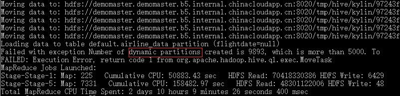

我们可以通过手动更改最大分区的默认个数的数值来规避这个问题：

在hive中运行命令：

`hive> set hive.exec.dynamic.partition.mode=nonstrict;`
`hive> set hive.exec.max.dynamic.partitions=20000;`

注意：引入插件包去分割符，会将所有字段强行转换为`String`类型，而后面我们对数据进行分析计算的时候，需要用到的是`integer`型，因此我们还需要对表中的原数据进行一次数据转换；

在hive中运行命令：

```sql
INSERT INTO TABLE airline partition(FlightDate)
SELECT cast(YEAR AS int) AS YEAR,
       cast(Quarter AS int) AS Quarter,
       cast(MONTH AS int) AS MONTH,
       cast(DayofMonth AS int) AS DayofMonth,
       cast(DayOfWeek AS int) AS DayOfWeek,
       cast(UniqueCarrier AS string) AS UniqueCarrier,
       cast(AirlineID AS bigint) AS AirlineID,
       cast(Carrier AS string) AS Carrier,
       cast(TailNum AS string) AS TailNum,
       cast(FlightNum AS int) AS FlightNum,
       cast(OriginAirportID AS bigint) AS OriginAirportID,
       cast(OriginAirportSeqID AS bigint) AS OriginAirportSeqID,
       cast(OriginCityMarketID AS bigint) AS OriginCityMarketID,
       cast(Origin AS string) AS Origin,
       cast(OriginCityName AS string) AS OriginCityName,
       cast(OriginState AS string) AS OriginState,
       cast(OriginStateFips AS int) AS OriginStateFips,
       cast(OriginStateName AS string) AS OriginStateName,
       cast(OriginWac AS int) AS OriginWac,
       cast(DestAirportID AS int) AS DestAirportID,
       cast(DestAirportSeqID AS bigint) AS DestAirportSeqID,
       cast(DestCityMarketID AS bigint) AS DestCityMarketID,
       cast(Dest AS string) AS Dest,
       cast(DestCityName AS string) AS DestCityName,
       cast(DestState AS string) AS DestState,
       cast(DestStateFips AS int) AS DestStateFips,
       cast(DestStateName AS string) AS DestStateName,
       cast(DestWac AS int) AS DestWac,
       cast(CRSDepTime AS int) AS CRSDepTime,
       cast(DepTime AS int) AS DepTime,
       cast(DepDelay AS int) AS DepDelay,
       cast(DepDelayMinutes AS int) AS DepDelayMinutes,
       cast(DepDel15 AS int) AS DepDel15,
       cast(DepartureDelayGroups AS int) AS DepartureDelayGroups,
       cast(DepTimeBlk AS string) AS DepTimeBlk,
       cast(TaxiOut AS int) AS TaxiOut,
       cast(WheelsOff AS int) AS WheelsOff,
       cast(WheelsOn AS int) AS WheelsOn,
       cast(TaxiIn AS int) AS TaxiIn,
       cast(CRSArrTime AS int) AS CRSArrTime,
       cast(ArrTime AS int) AS ArrTime,
       cast(ArrDelay AS int) AS ArrDelay,
       cast(ArrDelayMinutes AS int) AS ArrDelayMinutes,
       cast(ArrDel15 AS int) AS ArrDel15,
       cast(ArrivalDelayGroups AS int) AS ArrivalDelayGroups,
       cast(ArrTimeBlk AS string) AS ArrTimeBlk,
       cast(Cancelled AS int) AS Cancelled,
       cast(CancellationCode AS string) AS CancellationCode,
       cast(Diverted AS int) AS Diverted,
       cast(CRSElapsedTime AS int) AS CRSElapsedTime,
       cast(ActualElapsedTime AS int) AS ActualElapsedTime,
       cast(AirTime AS int) AS AirTime,
       cast(Flights AS int) AS Flights,
       cast(Distance AS bigint) AS Distance,
       cast(DistanceGroup AS int) AS DistanceGroup,
       cast(CarrierDelay AS int) AS CarrierDelay,
       cast(WeatherDelay AS int) AS WeatherDelay,
       cast(NASDelay AS int) AS NASDelay,
       cast(SecurityDelay AS int) AS SecurityDelay,
       cast(LateAircraftDelay AS int) AS LateAircraftDelay,
       cast(FirstDepTime AS int) AS FirstDepTime,
       cast(TotalAddGTime AS int) AS TotalAddGTime,
       cast(LongestAddGTime AS int) AS LongestAddGTime,
       cast(DivAirportLandings AS int) AS DivAirportLandings,
       cast(DivReachedDest AS int) AS DivReachedDest,
       cast(DivActualElapsedTime AS int) AS DivActualElapsedTime,
       cast(DivArrDelay AS int) AS DivArrDelay,
       cast(DivDistance AS int) AS DivDistance,
       cast(Div1Airport AS int) AS Div1Airport,
       cast(Div1AirportID AS int) AS Div1AirportID,
       cast(Div1AirportSeqID AS int) AS Div1AirportSeqID,
       cast(Div1WheelsOn AS int) AS Div1WheelsOn,
       cast(Div1TotalGTime AS int) AS Div1TotalGTime,
       cast(Div1LongestGTime AS int) AS Div1LongestGTime,
       cast(Div1WheelsOff AS int) AS Div1WheelsOff,
       cast(Div1TailNum AS int) AS Div1TailNum,
       cast(Div2Airport AS int) AS Div2Airport,
       cast(Div2AirportID AS int) AS Div2AirportID,
       cast(Div2AirportSeqID AS int) AS Div2AirportSeqID,
       cast(Div2WheelsOn AS int) AS Div2WheelsOn,
       cast(Div2TotalGTime AS int) AS Div2TotalGTime,
       cast(Div2LongestGTime AS int) AS Div2LongestGTime,
       cast(Div2WheelsOff AS int) AS Div2WheelsOff,
       cast(Div2TailNum AS int) AS Div2TailNum,
       cast(Div3Airport AS int) AS Div3Airport,
       cast(Div3AirportID AS int) AS Div3AirportID,
       cast(Div3AirportSeqID AS int) AS Div3AirportSeqID,
       cast(Div3WheelsOn AS int) AS Div3WheelsOn,
       cast(Div3TotalGTime AS int) AS Div3TotalGTime,
       cast(Div3LongestGTime AS int) AS Div3LongestGTime,
       cast(Div3WheelsOff AS int) AS Div3WheelsOff,
       cast(Div3TailNum AS int) AS Div3TailNum,
       cast(Div4Airport AS int) AS Div4Airport,
       cast(Div4AirportID AS int) AS Div4AirportID,
       cast(Div4AirportSeqID AS int) AS Div4AirportSeqID,
       cast(Div4WheelsOn AS int) AS Div4WheelsOn,
       cast(Div4TotalGTime AS int) AS Div4TotalGTime,
       cast(Div4LongestGTime AS int) AS Div4LongestGTime,
       cast(Div4WheelsOff AS int) AS Div4WheelsOff,
       cast(Div4TailNum AS int) AS Div4TailNum,
       cast(Div5Airport AS int) AS Div5Airport,
       cast(Div5AirportID AS int) AS Div5AirportID,
       cast(Div5AirportSeqID AS int) AS Div5AirportSeqID,
       cast(Div5WheelsOn AS int) AS Div5WheelsOn,
       cast(Div5TotalGTime AS int) AS Div5TotalGTime,
       cast(Div5LongestGTime AS int) AS Div5LongestGTime,
       cast(Div5WheelsOff AS int) AS Div5WheelsOff,
       cast(Div5TailNum AS int) AS Div5TailNum,
       cast(FlightDate AS date) AS FlightDate
FROM airline_data
```
## 在Apache Kylin中创建数据模型

### 创建项目和Model

创建一个新的项目，并命名为*Airline*。

 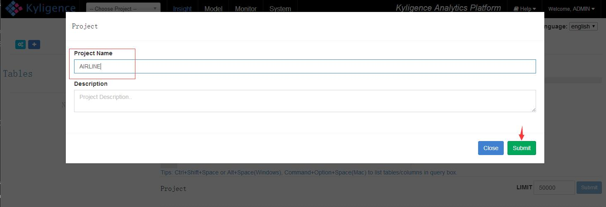

第一步，选择刚刚创建的项目*Airline*

 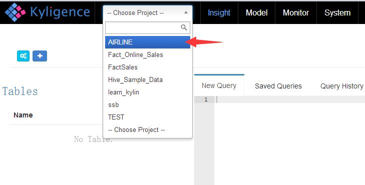

第二步，同步Hive表

​	需要把Hive数据表同步到*Apache Kylin*当中才能使用。为了方便操作，我们通过``Load Hive Table From Tree``进行同步，如下图所示： 

 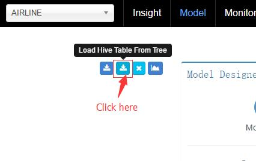

 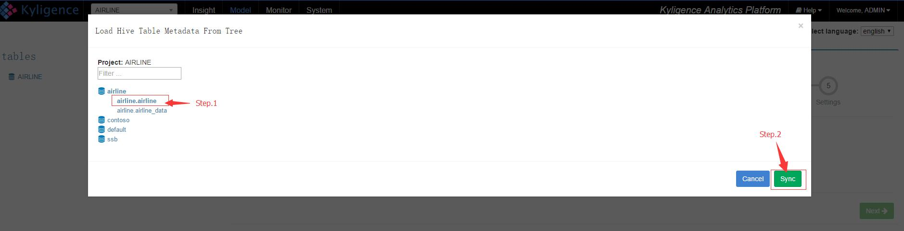

点击`sync`同步，导入数据

 

第三步，开始创建名为*Airline*的`Model`。

 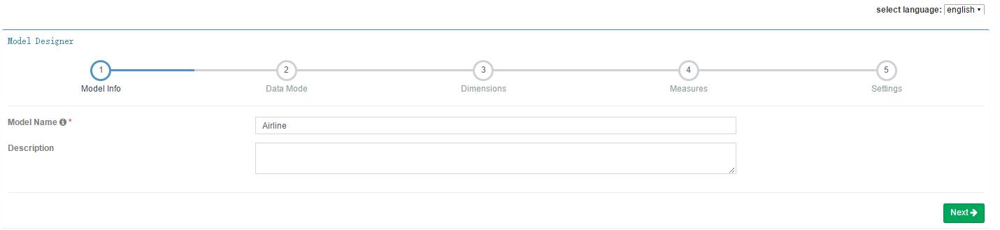

第四步，选择事实表。

 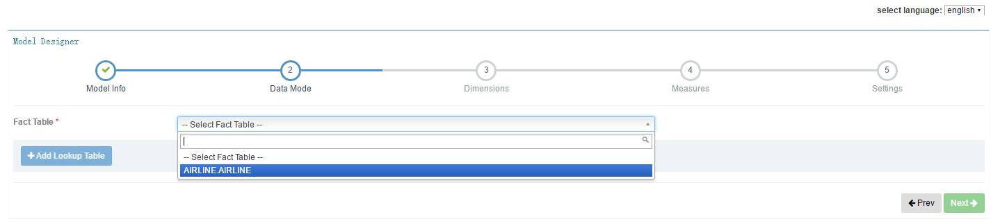

 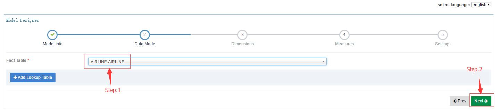

第五步，选择维度和度量。

在本案例中，只有一个事实表：

​	1、为了能够根据日期进行分析，因此将所含的时间列：`Year`，`Quarter`，`Month`，`DayOfMonth`，`DayOfWeek`，`FlightDate` 设为维度。

​	2、为了能够根据航空公司运营情况进行分析，因此将所含的航线属性列：`UniqueCarrier`，`AirlineID`，`DestCityName`，`OriginCityName`，`DestState`，`OriginState`，`ArrTimeBLK`，`DepTimeBLK`，`DepDel15`，`ArrDel15`，`Cancelled`，`Diverted`设为维度。

​	3、为了能够对各航空公司运营情况进行比较分析，因此将所含记录飞行时间的数据列：`Flights`，`DepDelayMinutes`，`ArrDelayMinutes`，`Distance`，`ActualElapsedTime`设为度量。

因此，选择的维度和度量如下:

选择维度

	1.Year
	2.Quarter
	3.Month
	4.DayOfMonth
	5.DayOfWeek
	6.FlightDate
	7.UniqueCarrier
	8.AirlineID
	9.ArrTimeBLK
	10.DepTimeBLK
	11.DestCityName
	12.OriginCityName
	13.DestState
	14.OriginState
	15.DepDel15
	16.ArrDel15
	17.Cancelled
	18.Diverted

选择度量

	1.Flights
	2.DepDelayMinutes
	3.ArrDelayMinutes
	4.Distance
	5.ActualElapsedTime

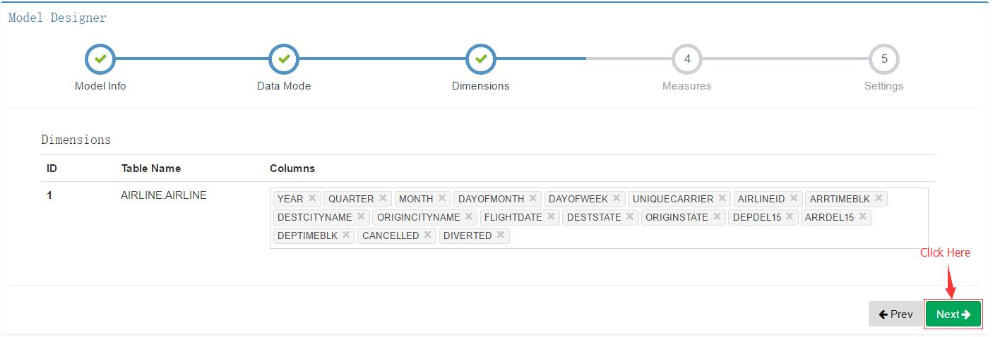

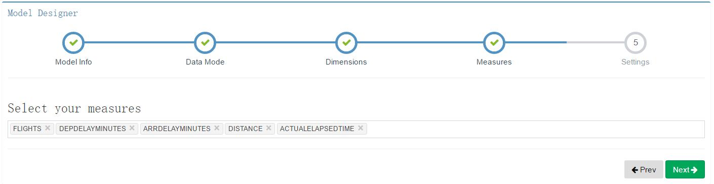

第六步，选择分区字段`FlightDate`及字段里日期数据的格式。

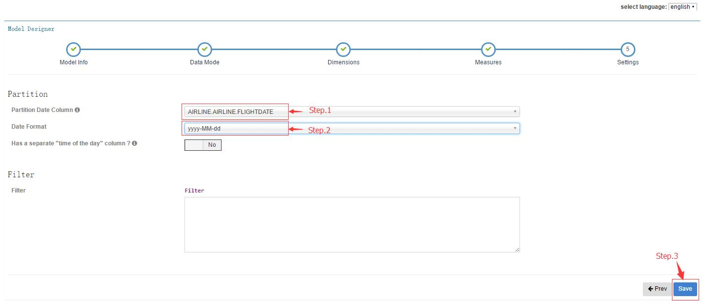

### 设计 Cube

第一步，选择添加`Cube`。

 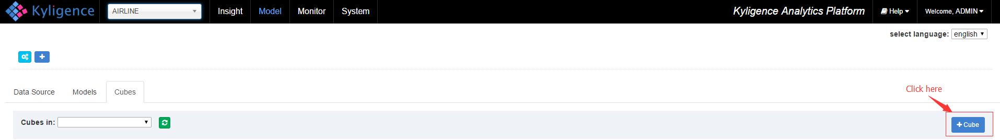

第二步，选择刚刚创建的名为*Airline*的`Model`，并建一个名为*Airline*的`Cube`。

 

第三步，点击`Auto Generator`并全选所有字段。

 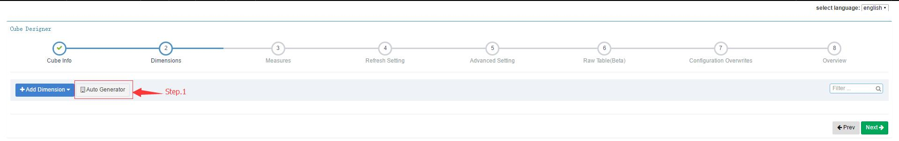

 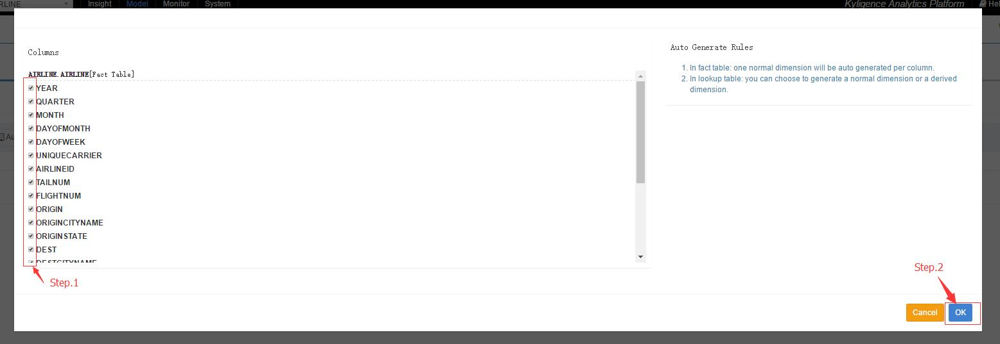

第四步，写入需要计算的度量。

 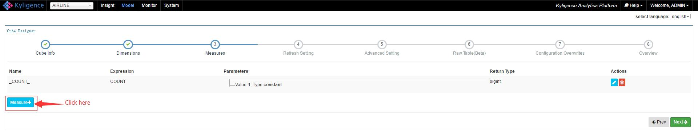

 例如：

​	 1、我们要查询各航空公司的销售的总机票数：```select sum(Flights),UniqueCarrier from airline group by UniqueCarrier;```需要用到 `sum(Flights) `。
 	2、我们要查询各航空公司的最大延误时间：```select max(Depdelayminutes),UniqueCarrier from airline group by UniqueCarrier;```需要用到 `max(Depdelayminutes) `。

 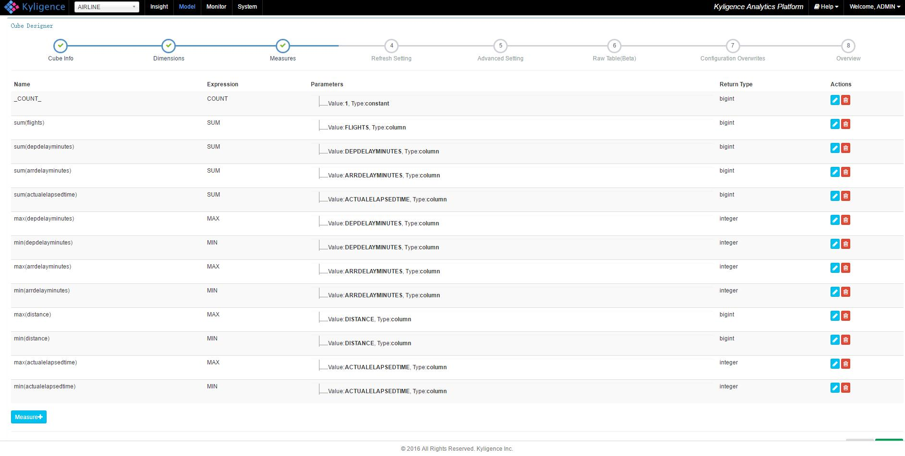

第五步， 根据数据选择数据的开始时间，在本次案例中，我选择的时间为 `1987-10-1 00:00:00`

 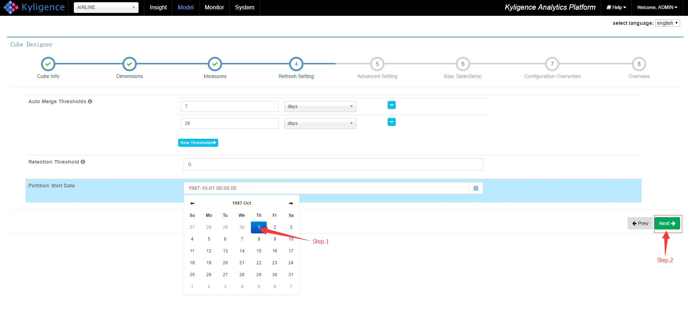

第六步，由于需要查询的维度较多，我们通常建议Cube的物理维度（除去衍生维度）在15个以内，当有更多维度的时候，务必分析用户查询模式和数据分布特征，采取维度分组，定义*Mandatory Dimensions*、*Hierarchy Dimensions*和  *Joint Dimensions* 等高级手段，避免维度间的肆意组合（“维度的灾难”），从而使得Cube的构建时间和所占空间在可控范围。

 *Mandatory Dimensions*：`UniqueCarrier`

 *Hierarchy Dimensions*：`Year`，`Quarter`，`Month`，`DayOfWeek`，`FlightDate`

 *Joint Dimensions*：

1.`DepDel15`，`ArrDel15`，`Cancelled`，`Diverted`

2.`OriginCityName`，`OriginState`

3.`DestCityName`，`DestState`

4.`DepTimeBLK`，`ArrTimeBLK`

如下图：

 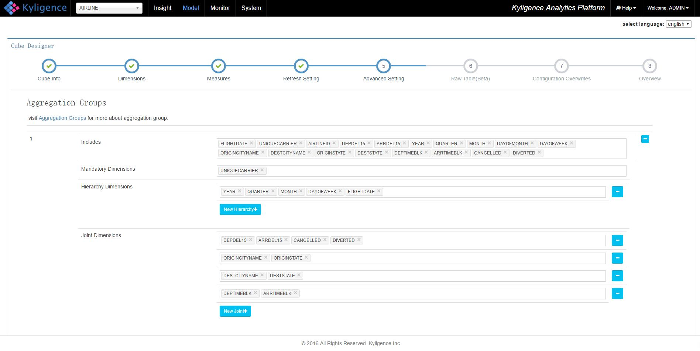

注意：

​	1、因为整个案例都是围绕着航空公司的一个分析，因此每个分析场景中必须出现的字段是`UniqueCarrier`，因此这里我们可以将它设置为一个*Mandatory Dimensions*。

​	2、由于`Year`，`Quarter`，`Month`，`DayOfWeek`，`FlightDate`这几个字段之间存在层层递进的关系，因此这里我们可以将它设置为一个*Hierarchy Dimensions*。

​	3、建立*Joint Dimensions*的选择标准是：

​		a.字段之间存在一对一的关系。例如：目的地名字`DestCityName`和目的地代号`DestState`就存在一对一的关系。

​		b.字段的基数较小。例如：`DepDel15`，`ArrDel15`，`Cancelled`，`Diverted`，只有`0`和`1`两种值。

​	        c.如果要查询的场景中，有两个字段必须同时出现，或者同时消失。例如：我要查询`DepTimeBLK`时，要求`ArrTimeBLK`的数据必须同时出现。

第七步：调整rowkey次序。

 Rowkey的设计原则如下图：

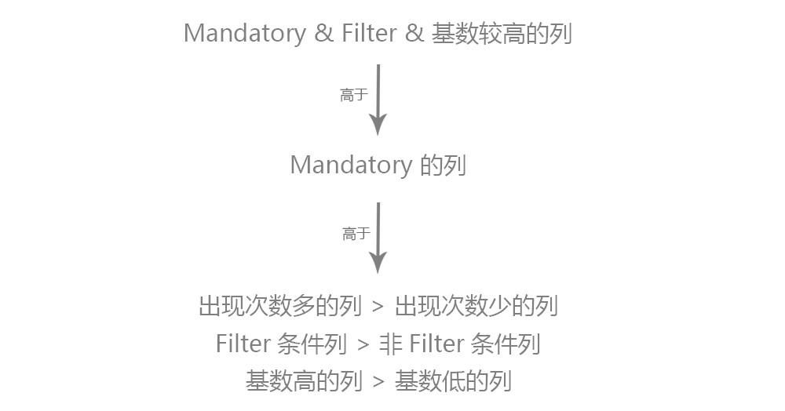

例如：

1、本案例中，*Mandatory & Filter & 基数较高* 的列是：`FlightDate` ，因此这里我们把它排在第一位。

2、由于之前我们选择的*Mandatory Dimensions*是：`UniqueCarrier` ，因此这里我们把它排在第二位。

以上图所示的优先级类推。


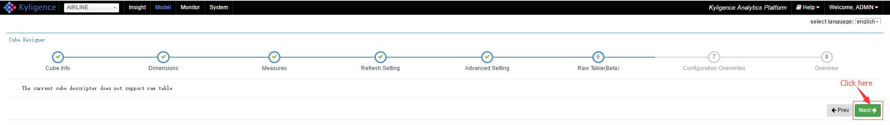

 第八步，添加`Key`。

 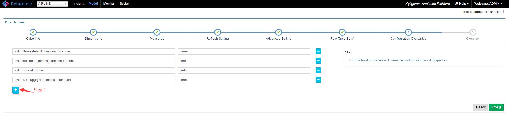

 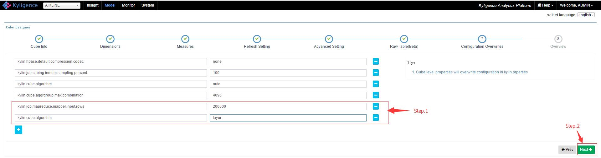

 注意：

 	1、由于MapReduce的`kylin.job.mapreduce.mapper.input.rows`默认值为`1000000`，由于测试环境计算资源有限，在Mapper运行时可能会发生超时（默认超时时间为1小时），我们可以通过缩小这个值，限制单个Mapper处理的数据量，同时也可以增加并发构建的程度。

 	2、我们在建多维数据模型时，在内存不足，而数据量规模较大时，为了减少对内存的损耗，我们改为*layer*算法构建cube，重定义`kylin.cube.algorithm`的值为*layer*。

第九步，完成。

 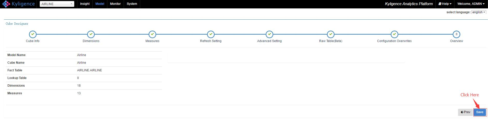

### 构建 Cube

 第一步：选择刚刚创建的*Cube*,在`Actions`里选择`Build`，如下图：

  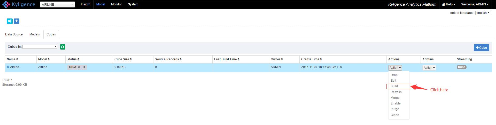

 第二步：选择结束日期，本案例中我选择的是`2016-09-01 00:00:00`。

 注意：为了方便以后增加新的数据*Cube*进来，所选择的时间区间一定要与所载入数据的时间区间保持一致。

  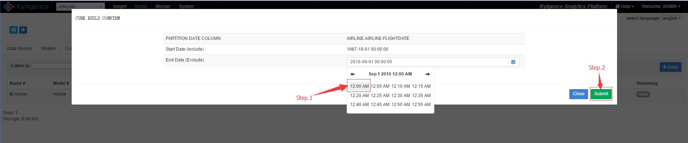

 查看*Cube*进度：

 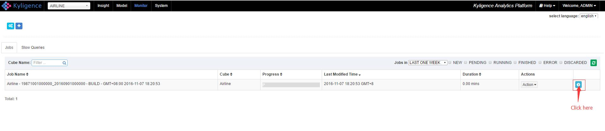

 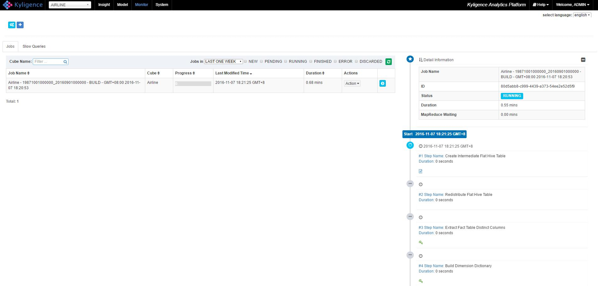

 构建 *Cube* 完成：

 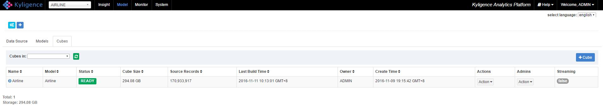

### 验证 Cube

在完成以上工作之后，我们可以在``Insight``页面对数据进行验证查询：

 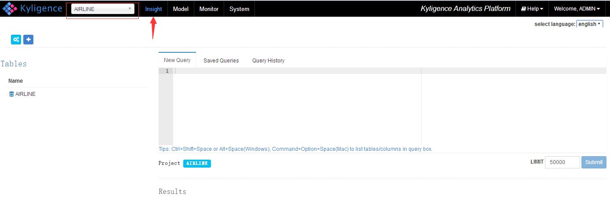

例如：我们要查询各个航空公司2015年的机票销售数量，我们可以在`New Query`里输入如下 SQL语句：

```sql
 select sum(Flights),UniqueCarrier from airline where airline."YEAR"=2015 group by UniqueCarrier;
```
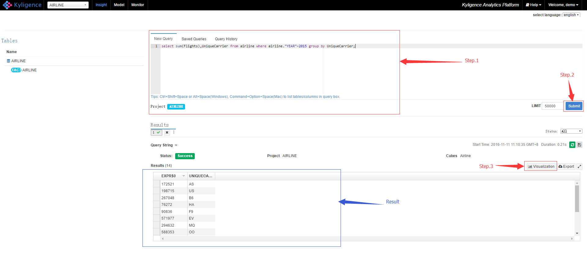

为了更直观的查看数据，点击可视化，我们可以看到以图形化方式展示的数据查询结果(如上图的`Step.3`)。

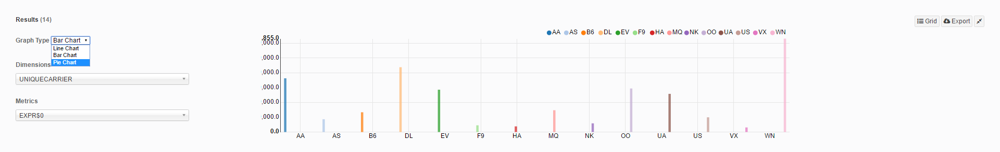

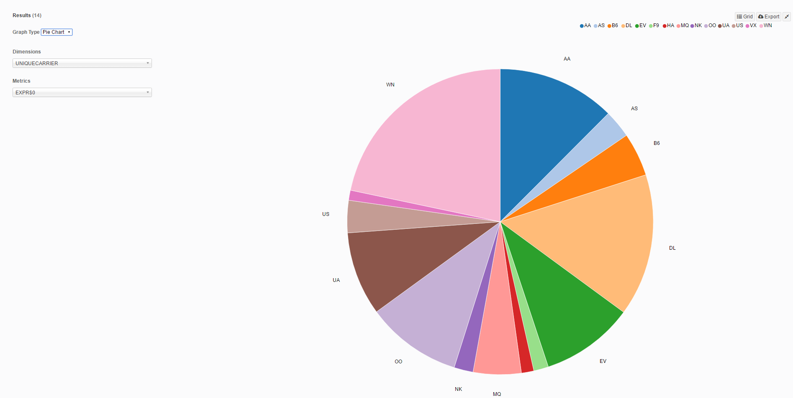

## 在KyAnalyzer中制作报表
​	KyAnalyzer是Kyligence Analytics Platform（KAP）内置的敏捷式BI平台，允许用户以拖拽的方式自助地制作数据报表，让用户以最简单快捷的方式访问Kylin的数据。

例如：我们要查询各个航空公司2015年的航班数量：

第一步，在`Admin Console`加载*Cube*，操作如图所示：


第二步，在`New query`中 `添加`/`选择` 计算维度：

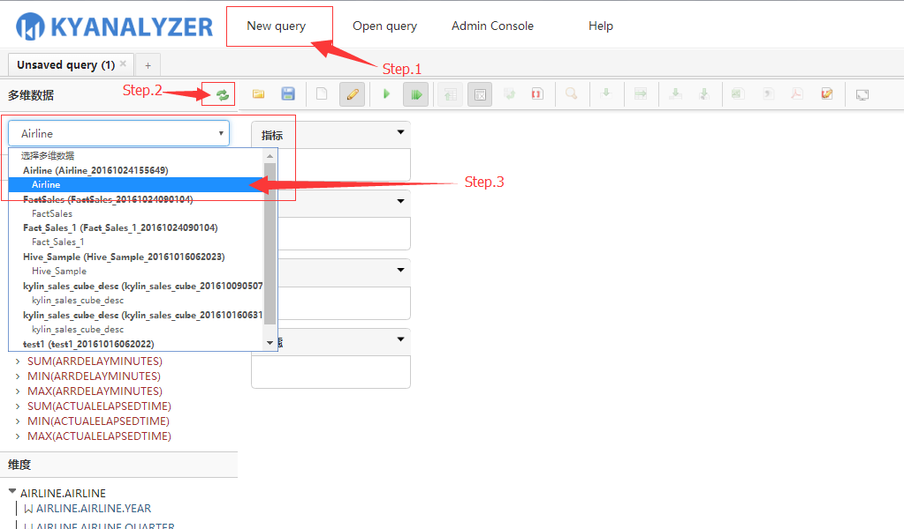

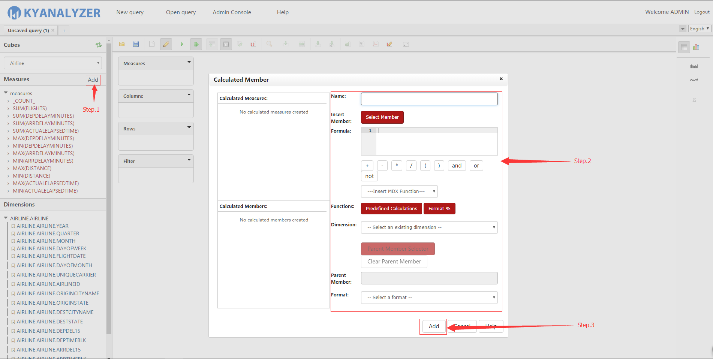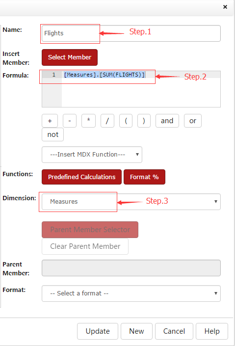

第三步，筛选数据：

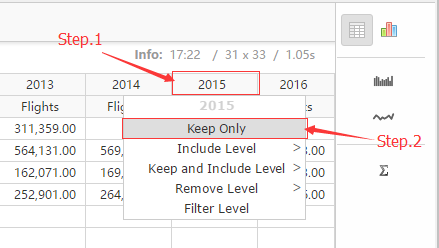

第四步，生成数据表：

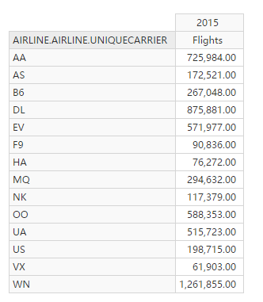

第五步，选择右菜单栏图表模式，将生成的数据表以图标的形式展现：

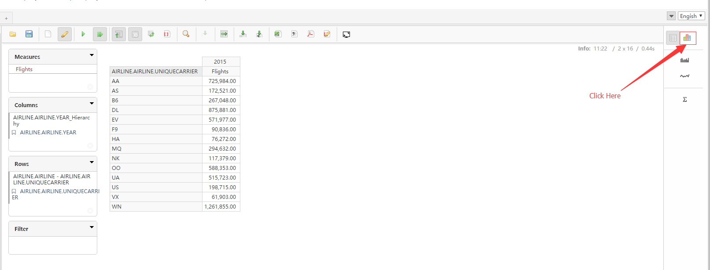

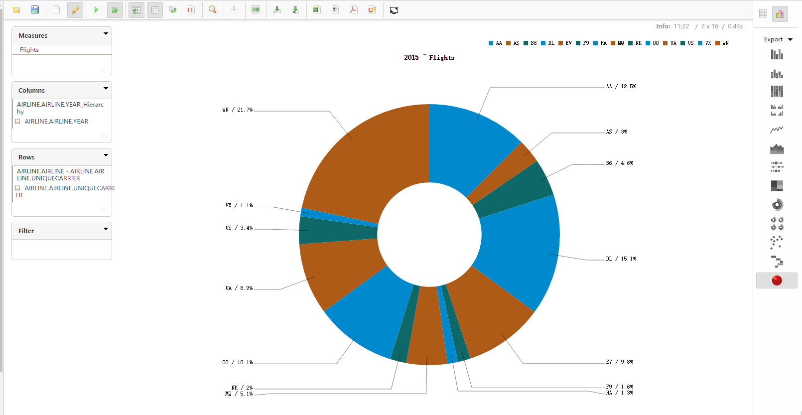

点击如图位置更改行列。行：`Year`，列：`UniqueCarrier`。

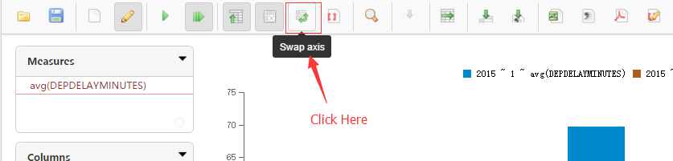


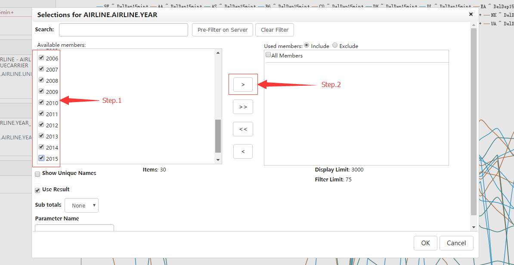


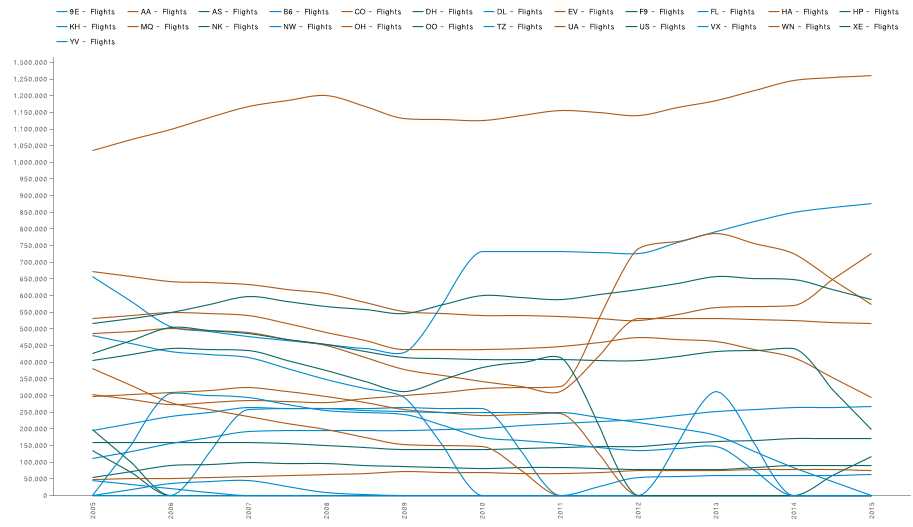

更多数据的筛选条件菜单，如图：

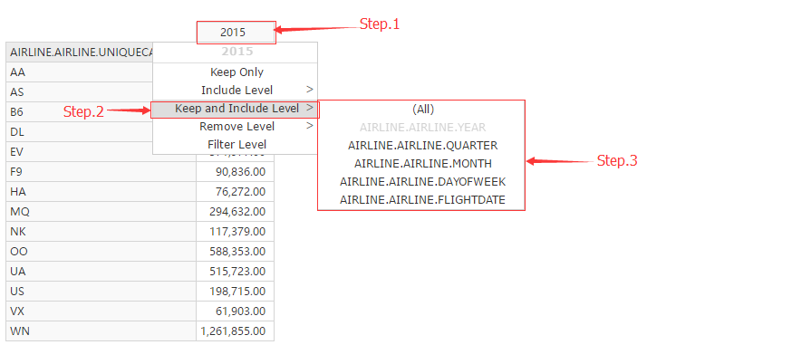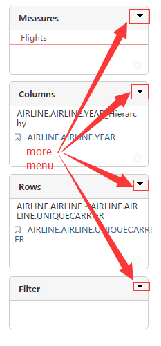

了解以上操作流程后，我们可以继续进行下面的分析：

### 准点率分析

计算2015年各航空公司准点率的SQL如下：
```sql
select t1.UniqueCarrier,"YEAR",1.0*t1.a/t2.a as OnTime from (
	select count(*) as a,UniqueCarrier,"YEAR" from airline where "DEPDEL15"=0 and "YEAR"=2015 group by UniqueCarrier,"YEAR"
		) t1 inner join (
			select count(*) as a,UniqueCarrier from airline where "YEAR"=2015 group by UniqueCarrier
				) t2 on t1.UniqueCarrier =t2.UniqueCarrier;
```
选择维度：

	1.UniqueCarrier
	2.DepDel15
	3.Year
选择度量：

    1.count(1)
​	为了保证样本的准确性，我们抽取十年（2005年 — 2015年）的准点率数据来对各航空公司准点率进行比较分析：

在KyAnalyzer制作表如下：

​									（2005年 — 2015年）准点率

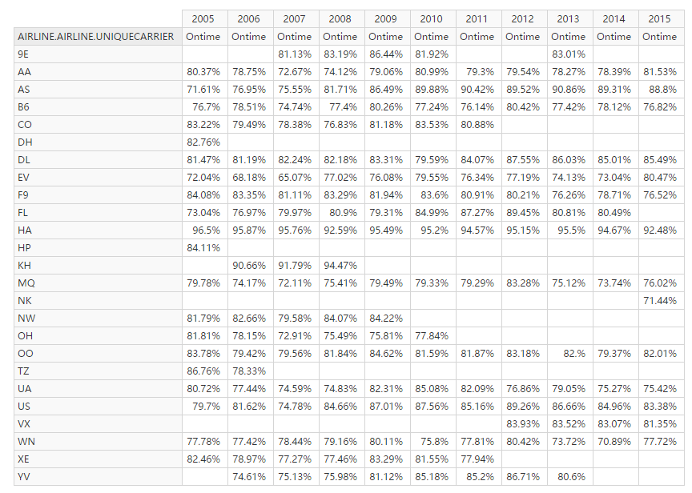

​						（2005年 — 2015年）各航空公司准点率柱状图

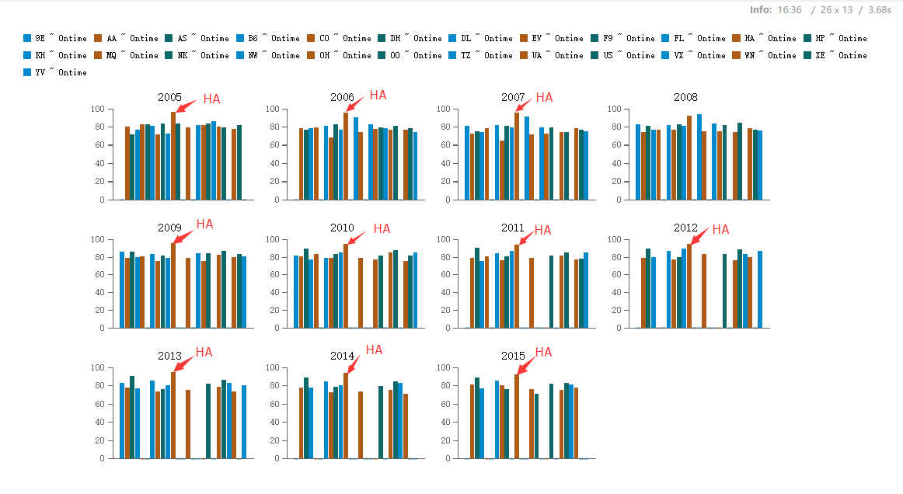

这里我们着重筛选出这十年中准点率最高的前三名进行分析：

如：抽取2005年准点率前三名的SQL如下：

```sql
select t1.UniqueCarrier,"YEAR",1.0*t1.a/t2.a as OnTime from (
	select count(*) as a,UniqueCarrier,"YEAR" from airline where "DEPDEL15"=0 and "YEAR"=2005 group by UniqueCarrier,"YEAR"
		) t1 inner join (
			select count(*) as a,UniqueCarrier from airline where "YEAR"=2005 group by UniqueCarrier
				) t2 on t1.UniqueCarrier =t2.UniqueCarrier order by OnTime desc limit 3;
```
以此类推，记录下十年间前三名的公司：

|      |  1   |  2   |  3   |
| :--: | :--: | :--: | :--: |
| 2005 |  HA  |  AS  |  DL  |
| 2006 |  HA  |  KH  |  F9  |
| 2007 |  HA  |  KH  |  DL  |
| 2008 |  KH  |  HA  |  US  |
| 2009 |  HA  |  US  |  OO  |
| 2010 |  HA  |  AS  |  US  |
| 2011 |  HA  |  AS  |  FL  |
| 2012 |  HA  |  AS  |  FL  |
| 2013 |  HA  |  AS  |  US  |
| 2014 |  HA  |  AS  |  DL  |
| 2015 |  HA  |  AS  |  DL  |

（由于美国交通运输部公布的航空公司的数据不够完整和全面，部分航空公司的航空数据在部分年份存在缺失，所以我们暂时将数据为空的航公司数据产生的影响忽略不计。）

​	由上表我们可以很轻易的发现，除了2008年被 KH 公司超越以外，HA 的准点率稳处于行业间领先地位，AS 航空公司表现其次，F9和OO公司分别在2006年和2009年挤进行业前三，因此，我们可以抽选出比较特殊的HA,AS,F9,OO这四家航空公司再进一步的分析。

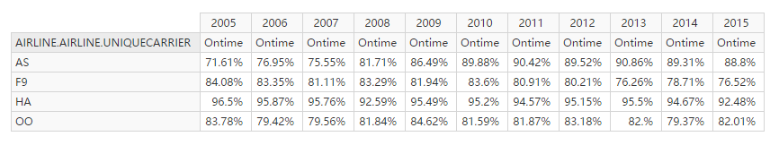

​					（2005年 — 2015年）HA,AS,F9,OO这四家航空公司的准点率折线图

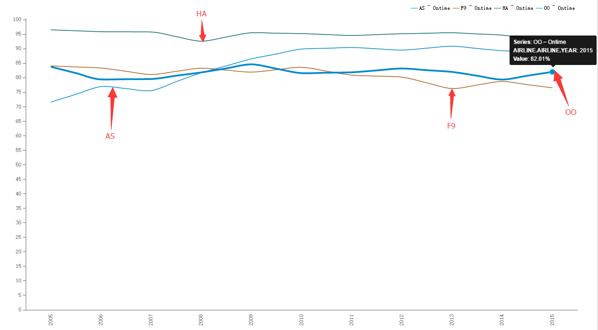

从上图中我们不难看出：

​		1、HA的准点率波动较小，一直保持在领先位置。

​		2、F9和OO公司在准点率上其实差距不大。

​		3、AS公司的准点率一直在不断提升。

### 平均延误时间分析

​	在上文对HA,AS,F9,OO这四家航空公司的准点率分析的基础上，我们想要更深一步了解其他因素对准点率变化的影响。所以接下来，我们继续对这四家公司进行平均延误时间的分析。

```sql
select avg(DEPDELAYMINUTES),UniqueCarrier,"YEAR" from airline where "UNIQUECARRIER" in ('HA','AS','F9','OO') and "YEAR" between 2005 and 2015 group by UniqueCarrier,"YEAR";
```

选择维度：

```
1.UniqueCarrier
2.DepDel15
3.Year
```

选择度量：

```
1.avg(DepDelayMinutes)
```

在KyAnalyzer制作表如下：

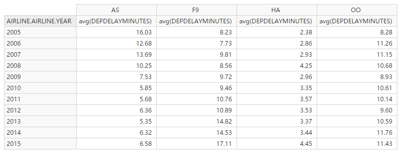

​				（2005年 — 2015年）HA,AS,F9,OO这四家航空公司的平均延误时间折线图

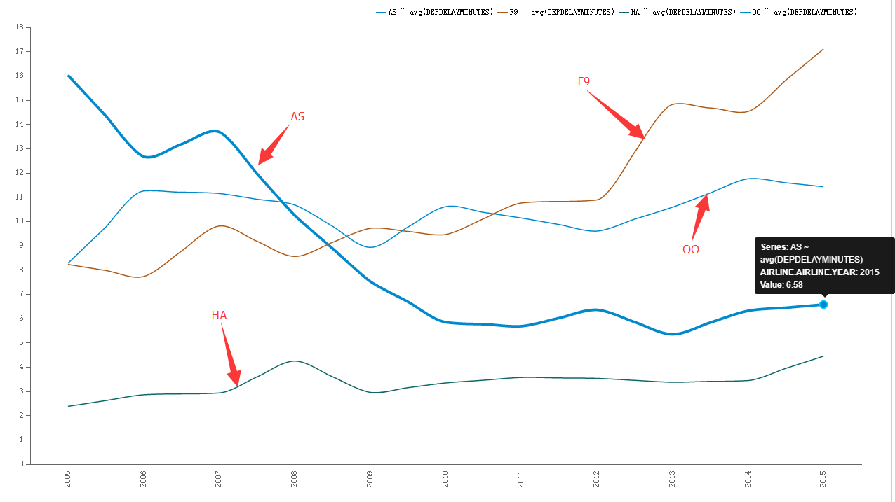

小结：由上图可知：

​	1、而准点率表现最好的 HA 公司，平均延误时间相较于其他公司也是最低的。

​	2、虽然F9和OO公司在准点率上差距不大，但F9的平均延误时间在不断增加，而OO公司是相对稳定的。所以	总体而言，OO公司的运营情况是优于F9公司的。

​	3、AS 公司的平均延误时间在逐年降低，经过前面的分析，我们了解到AS公司的准点率也是在不断提升的，因此，我们可以得出结论，说明AS公司的管理模式积极且有效的。

### 航班情况分析

​	现在，我们想要对HA,AS,F9,OO这四家航空公司的综合情况进行考量，因此，同样我们还需要抽取这四家航空公司2012年9月到2016年8月的航班数量，进行一个比较分析。

我们可以直接可以通过KyAnalyzer制作图表如下：

​				（2012年9月—2016年8月）HA,AS,F9,OO这四家航空公司的航班数变化情况折线图

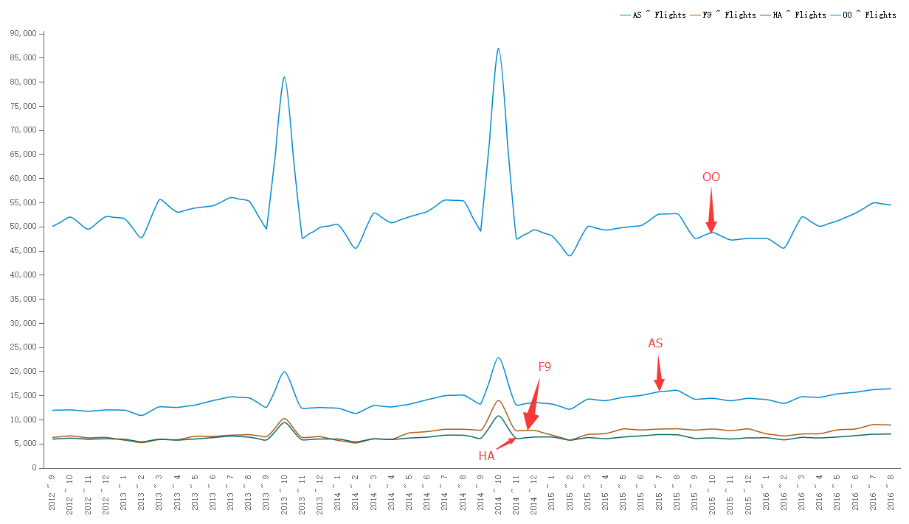

小结：当显示结果细化到月份后，我们发现：

​	1、OO公司航班数远远大于其他三家。

​	2、各航空公司在2013年9月至11月，和2014年9月至11月，航班数均有显著增加的波动，且较为同步。

经过对我们抽选出的HA,AS,F9,OO这四家典型公司的准点率、平均延误时间、航班数综合计算的分析结果，我们可以得出如下结论：

​	1、HA是服务品质最高的公司。

​	2、OO是规模最大的公司。

​	3、F9公司管理模式不是太好，需要对管理模式及运营模式加强完善。

​	4、AS是最具潜力的公司。

## 总结

​	经过从数据的处理到生成报表的一系列操作，我们对于*Apache Kylin*（KAP）和 KyAnalyzer 的使用有了更为明确的了解，更为直观的认识，本文所述只是*Apache Kylin*和KyAnalyzer的一些基本用法。由于*Apache Kylin*与KyAnalyzer的功能强大，文章中不能进行一一的说明，还需要大家多多探究。本文旨在交流 *Apache Kylin*和 KyAnalyzer 的数据处理过程，所运用的数据有差异，结果也会出现差异，因此结论仅供参考。

作者：刘淑艳（Kyligence实习生）

联系我们：info@kyligence.io

上海跬智信息技术有限公司                                                                                                                                                [http://kyligence.io](http://kyligence.io/)

*转载请注明出处，原文及来源。*

参考资料：

http://kyligence.io

http://kylin.apache.org

http://www.transtats.bts.gov/DL_SelectFields.asp?Table_ID=236&DB_Short_Name=On-Time

http://kyligence.gitbooks.io/KAP-manual/

https://github.com/Kyligence/learn_kylin/
