# 基于Apache Kylin 的销售分析示例

作者：陈志雄（Kyligence实习生） 

*注：转载请注明出处，原文及来源*

Contoso是微软提供的，作为数据分析学习的样本数据集，它模拟了一家公司的销售数据。Contoso数据集主要包括销售记录，客户信息，商品详细信息等。本文基于KAP（Kyligence Analytics Platform，Kylin的企业级发行版）对此数据进行了探索分析，了解每种商品的销售情况，分析各个季度的销售数据等。

KAP与Apache Kylin的建模流程一致，因此本示例同样适用于Apache Kylin，下文提到的Kylin与KAP是同一个意思。 

[TOC]

## 数据来源

数据来源于微软公开的Contoso数据，下载链接:[http://www.microsoft.com/en-us/download/details.aspx?id=18279](http://www.microsoft.com/en-us/download/details.aspx?id=18279)

下载解压后的文件格式为`.bak`，需要利用SQL Server还原数据库。还原之后数据便全部存储在SQL Server中，选取所需要的表的数据，右键点击可将其另存为CSV文件。

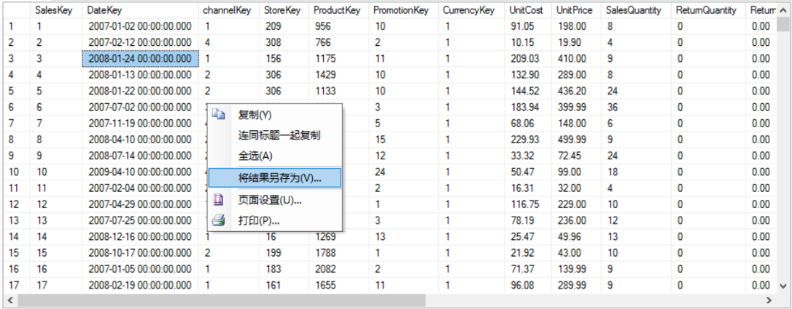

Contoso数据集共有26张表，在本案例中为了计算出每种商品的销售总额，每个季度的销售总额等信息，将会用到表`FactSales`，`DimDate`，`DimChannel`， `DimGeography`， `DimStore`， `DimProduct`， `DimProductSubcategory`， ` DimProductCategory`。因此将其中的数据导出。

表`FactSales`包括销售额，销售量，退货额，退货量等一系列销售信息。

表`DimDate`包括年份，季度，月份等一系列时间信息。

表`DimChannel`包括销售渠道等信息。

表`DimGeography`包括所在洲，国家，省份，城市等一系列地理位置信息。

表`DimStore`包括商店名称，商店电话，商店负责人等一系列商店信息。

表`DimProduct`包括商品名称，商品的价格，商品的制造商等一系列商品信息。

表`DimProduSubcategory`包括商品子类名称等信息。

表`DimProductCategory`包括商品种类名称等信息。

  

 ## 导入Hive

Kylin支持从Hive导入数据源，因此需要首先将这些CSV文件导入Hive的表中。

第一步：上传`.CSV`文件到HDFS

在命令行中输入命令：

`hdfs dfs -put FactSales.csv /data/Contoso/FactSales`

第二步：先在hive中创建一个数据库`Contoso`

```sql
create database Contoso
use Contoso
```

第三步：根据CSV中数据结构在hive中构建表。

在hive中运行命令：
```sql
CREATE TABLE Contoso.FactSales(
  SalesKey int,
  DateKey timestamp, 
  ChannelKey int,
  StoreKey int, 
  ProductKey int, 
  PromotionKey int, 
  CurrencyKey int, 
  UnitCost float,
  UnitPrice float, 
  SalesQuantity int, 
  ReturnQuantity int,
  ReturnAmount float, 
  DiscountQuantity int, 
  DiscountAmount float, 
  TotalCost float, 
  SalesAmount float, 
  ETLLoadID int, 
  LoadDate timestamp, 
  UpdateDate timestamp) 
ROW FORMAT DELIMITED FIELDS TERMINATED BY ',' LOCATION'/data/Contoso/FactSales';
```
 (其中`ROW FORMAT DELIMITED FIELDS TERMINATED BY ','`表示字段与字段之间按“，”分割)

其他表的创建仿照上述命令完成。

[CreateTable.sql](sql/CreateTable.sql)

第四步：往创建成功的表中加载数据

在hive中运行命令：

```
load data local inpath  '/data/Contoso/FactSales/FactSales.csv'  into  table  FactSales;
```

(表示将文件`/data/Contoso/FactSales/FactSales.csv`中的数据加载进表`Contoso.FactSales`)

其他表的数据加载仿照上述命令完成。

第五步，调整数据模型到星型模型

目前Kylin只支持星型模型，而Contoso为雪花模型，因此需要做模型调整。我们可以通过创建视图的方式调整模型。

根据表`DimGeography`与表`DimStore`创建名为`Store_Geography`的视图。

根据表`DimProductSubcategory`与表`DimProductCategory`创建名为`ProductSubcategory_ProductCategory`的视图。

根据表`DimProduct`与视图`ProductSubcategory_ProductCategory`创建名为`Product_ ProductSubcategory`的视图。

```sql
Create view contoso.Store_Geography AS select 
DimStore.StoreKey, 
DimStore.GeographyKey, 
DimStore.StoreManager, 
DimStore.StoreType, 
DimStore.StoreName, 
DimStore.StoreDescription, 
DimStore.Status, 
DimStore.StorePhone, 
DimStore.StoreFax, 
DimStore.CloseReason, 
DimStore.EmployeeCount, 
DimStore.SellingAreaSize, 
DimGeography.GeographyType, 
DimGeography.ContinentName, 
DimGeography.CityName, 
DimGeography.StateProvinceName, 
DimGeography.RegionCountryName 
from contoso.DimStore inner join contoso.DimGeography onDimStore.GeographyKey = DimGeography.GeographyKey;
```

(表示表`contoso.DimGeography`内连接表`contoso.DimStore`，连接条件为`DimStore.GeographyKey   = DimGeography.GeographyKey`)

其他视图的创建仿照上述命令完成。

[CreateView.sql](sql/CreateView.sql)

执行`show tables`确认这些表和视图创建成功，确认这些数据已经导入成功，命令如下：

 

## 在Kylin中构建模型

下一步我们将在Kylin中，创建数据模型。

### 创建项目

第一步，创建一个新的项目，并命名为`FactSales` 。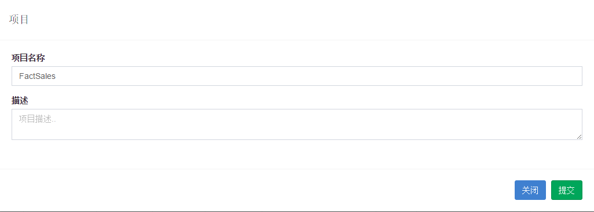

第二步，选择刚刚创建的项目。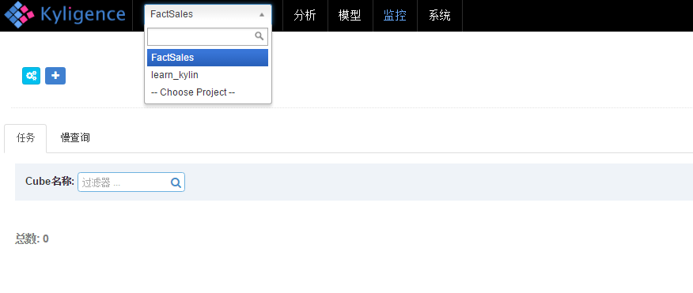

第三步，同步Hive表

需要把Hive数据表同步到Kylin当中才能使用。为了方便操作，我们通过`使用图形化树状结构方式加载Hive表`进行同步，如下图所示： 

 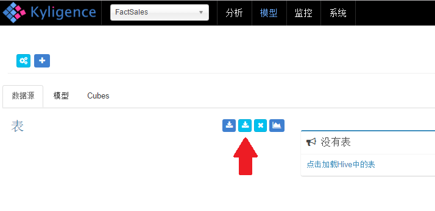

在弹出的对话框中展开Contoso数据库，并选择需要的五张表，如图所示 

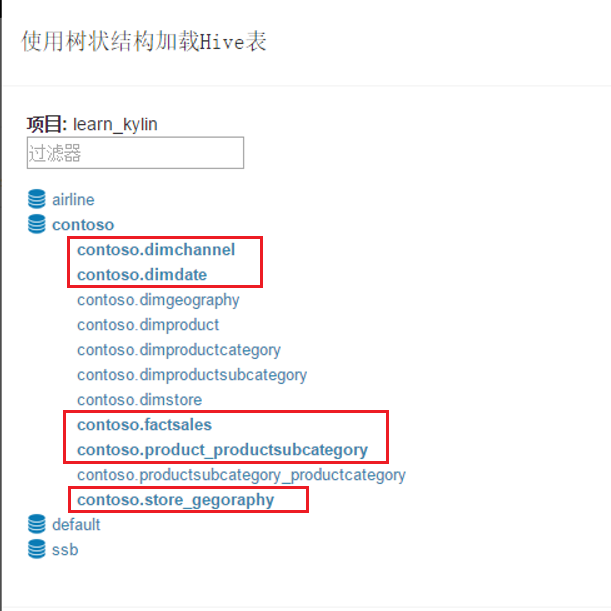

点击`同步`，导入数据

导入后系统会自动计算各表各列的维数，以掌握数据的基本情况。稍等几分钟后，我们可以通过`数据源`表的详情页查看这些信息。

 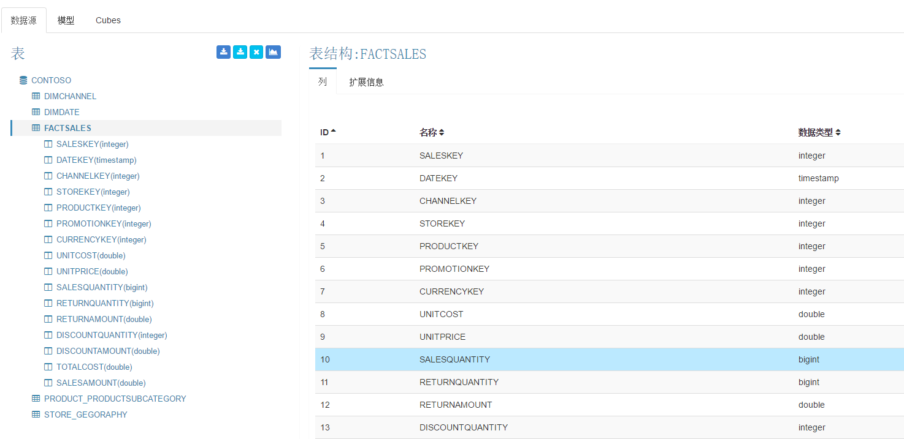

 

### 设计Cube

这是本次案例中所需要用到的表的E-R模型：

它原本的数据模型是雪花模型：


 由于Kylin目前仅支持星型模型，因此我们可以通过创建视图的方式调整模型，调整后为星型模型：


在本次案例中，

FactTable为表`FactSales` 

LookupTable为表`DimDate`，表`DimChannel`，视图`Store_Geography`和视图`Product_ ProductSubcategory` 。

为了能够根据地理位置进行分组，因此将视图`Store_Geography`的列`CITYNAME`，`CONTINENTNAME`，`STATEPROVINCENAME`，`REGIONCOUNTRYNAME`设为维度。

为了能够根据日期进行分组，因此将表`DimDate`的列`CALENDARYEAR`，`CALENDARQUARTER`，`CALENDARMONTH` 设为维度。

为了能够根据销售渠道进行分组，因此将表`DimChannel`的列`CHANNELNAME`设为维度。 

为了能够根据商品名称和加工方进行分组，因此将视图`Product_ ProductSubcategory`的列`PRODUCTSUBCATEGORYNAME`，`MANUFACTURER`，`PRODUCTCATEGORYNAME`，`PRODUCTNAME` 设为维度。

为了能够预计算销售情况的销售总数，销售总额等，因此将表`FactSales`中的列`UNITCOST`， `UNITPRICE`， `SALESAMOUNT`，`RETURNAMOUNT`，`SALESQUANTITY`，`RETURNQUANTITY`，`TOTALCOST`设为度量。

因此，选择的维度和度量如下:

#### a.维度

​    1.DimDate.CALENDARYEAR 

​    2.DimDate.CALENDARQUARTER

​    3.DimDate.CALENDARMONTH

​    4.Store_Geography.CITYNAME

​    5.Store_Geography.CONTINENTNAME

​    6.Store_Geography.STATEPROVINCENAME

​    7.Store_Geography.REGIONCOUNTRYNAME

​    8.DimChannel.CHANNELNAME

​    9.Product_ ProductSubcategory.PRODUCTSUBCATEGORYNAME

​    10.Product_ ProductSubcategory.MANUFACTURER

​    11.Product_ ProductSubcategory.PRODUCTCATEGORYNAME

​    12.Product_ ProductSubcategory.PRODUCTNAME

#### b.度量

 ​   1.FactSales.UNITCOST

​    2.FactSales.UNITPRICE

 ​   3.FactSales.SALESAMOUNT

 ​   4.FactSales.RETURNAMOUNT

 ​   5.FactSales.SALESQUANTITY

​    6.FactSales.RETURNQUANTITY

 ​   7.FactSales.TOTALCOST


### 创建模型 

选择刚刚创建的`FactSales`项目，然后进入“模型”页面，并创建一个模型。  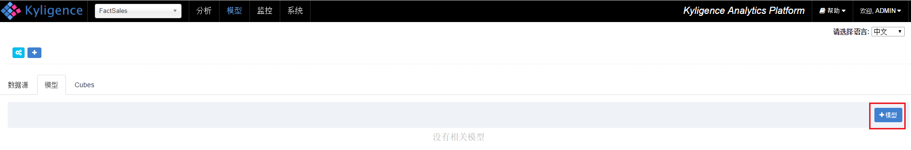

第一步，在基本信息页，输入模型名称为`Fact_Sale`，然后单击`下一步`。

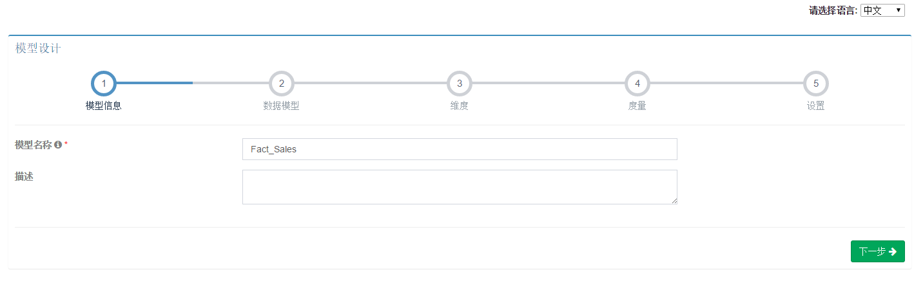

第二步，为模型选择事实表（Fact Table）和查找表（Lookup Table）。

并在FactTable: `FactSales`与LookupTable:`DimDate` ，`DIMCHANNEL`，`DimChannelProduct_ ProductSubcategory`，`Store_Geography`中建立连接。

DIMCHANNEL

连接类型：Inner

连接条件：`CONTOSO.FACTSALES.CHANNELKEY = CONTOSO.DIMCHANNEL.CHANNELKEY`  

STORE_GEGORAPHY

连接类型：Inner

连接条件:` CONTOSO.FACTSALES.STOREKEY = CONTOSO.STORE_GEGORAPHY.STOREKEY`

DIMDATE

连接类型：Inner

连接条件：`CONTOSO.FACTSALES.DATEKEY = CONTOSO.DIMDATE.DATEKEY`   

PRODUCT_PRODUCTSUBCATEGORY

连接类型：Inner

连接条件：`CONTOSO.FACTSALES.PRODUCTKEY = CONTOSO.PRODUCT_PRODUCTSUBCATEGORY.PRODUCTKEY`

下图是设置好之后的界面： 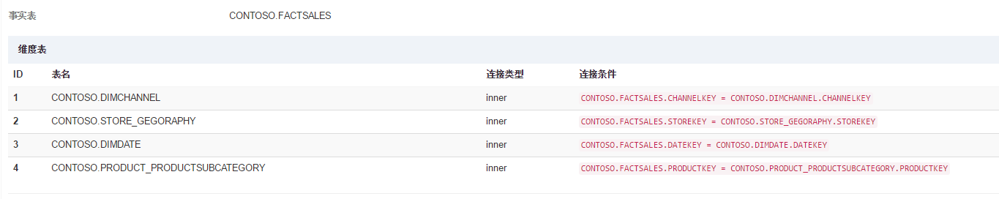

 第三步，从上一步添加的事实表和查找表中选择需要作为维度的字段。

在这个案例中，根据之前cube的设计选择维度。

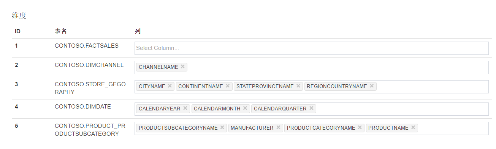

第四步，根据业务需要，从事实表上选择衡量指标的字段作为度量。

在在这个案例中，根据之前cube的设计选择度量。


第五步，设置根据时间分段。

由于本数据没有进行分区，因此不对分区进行选择。

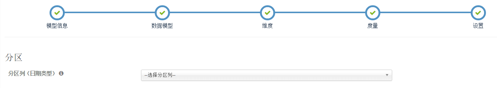

点击`保存`，完成创建Model。

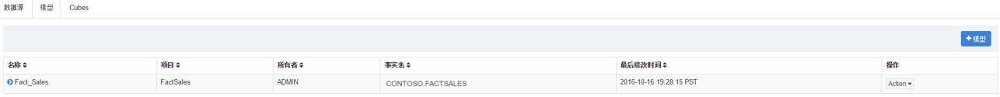

### 创建Cube

第一步，在“模型名称”中选择`Fact_Salea`，输入新建Cube的名称`Fact_Sales_1`，其余字段保持默认，然后单击`下一步`。

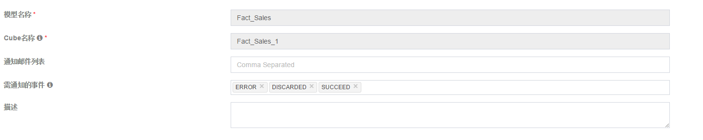

第二步，根据cube的设计选择相应维度:

点击`添加维度`


 

表`DIMCHANNEL` 的`CHANNELNAME`与表中的主键`CHANNELKEY`一一对应，因此将其设置为可推导维度。

视图`PRODUCT_PRODUCTSUBCATEGORY`的`PRODUCENAME`与表中的主键`PRODUCTKEY`一一对应，因此将其设置为可推导维度。

其余的则设定为普通维度。

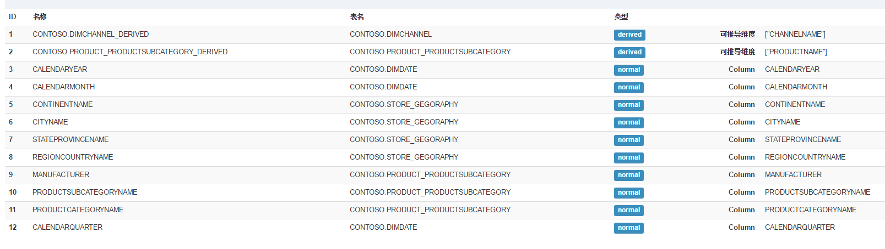

第三步，根据数据分析中的聚合需求，我们需要为Cube定义度量的聚合形式。 

默认的系统会自动创建好一个COUNT()聚合，用于考量交易的数量。

在这个案例中，我们还需要通过`SALESAMOUNT`，`SALEQUNATITY`等的聚合形式考量销售额销售量，如总销售额为`SUM(SALESAMOUNT)`。因此，我们手动创建七个度量，分别选择聚合表达式为SUM并选择`UNITCOST`， `UNITPRICE`，`SALESQUANTITY`，` SALESAMOUNT`，`RETURNQUANTITY`，` RETURNAMOUNT`，` TOTALCOST`列作为目标列。

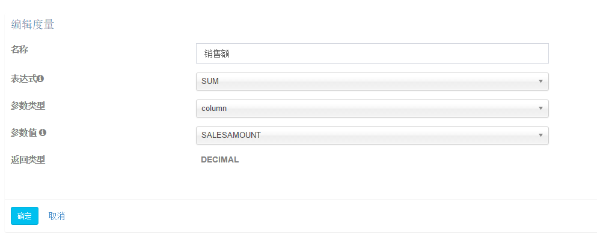

 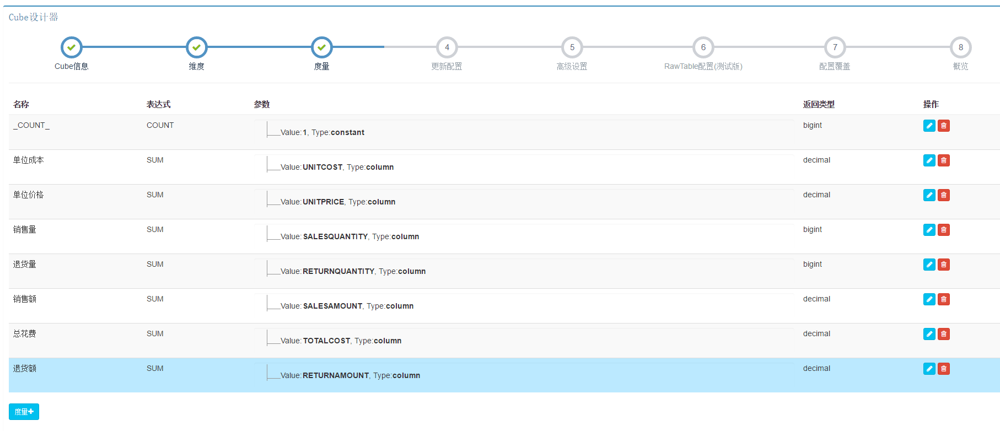

第四步，我们对Cube的构建和维护进行配置。

在这个案例中，我们没有对数据进行分区，因此在这里我们直接使用默认设置，不做任何修改。

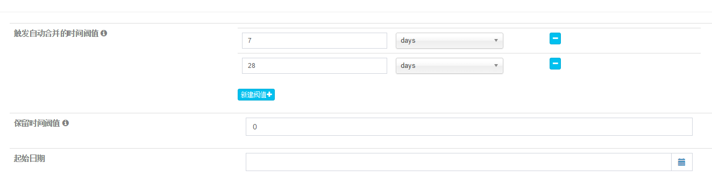 

第五步， 通过对Cube进行高级设置优化Cube的存储大小和查询速度，主要包括聚合组和Rowkey。

维度中的`CALENDARYEAR`，`CALENDARQUARTER`，`CALENDARMONTH`代表年，季度，月。

他们之间是层级关系，因此按顺序在层级维度中选取`CALENDARYEAR`，`CALENDARQUARTER`，`CALENDARMONTH`

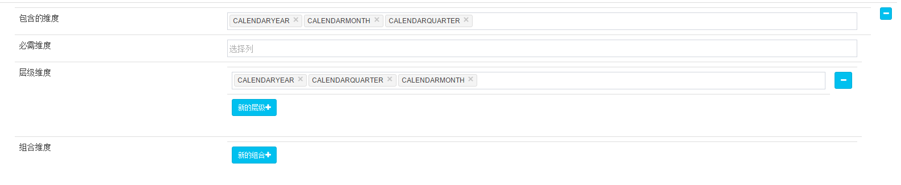

维度中的`CONTINENTNAME`，`REGIONCOUNTRYNAME`，`STATEPROVINCENAME`，`CITYNAME`代表洲，国，省，市。

他们之间是层级关系，因此按顺序在层级维度中选取`CONTINENTNAME`，`REGIONCOUNTRYNAME`，`STATEPROVINCENAME`，`CITYNAME`

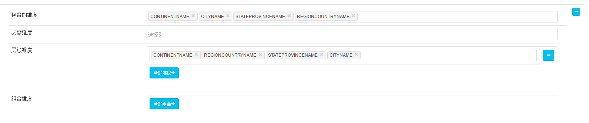

维度中的`PRODUCTCATEGORYNAME`，`PRODUCTSUBCATEGORYNAME`代表商品种类，商品子类。

他们之间是层级关系，因此按顺序在层级维度中选取`PRODUCTCATEGORYNAME`，`PRODUCTSUBCATEGORYNAME`

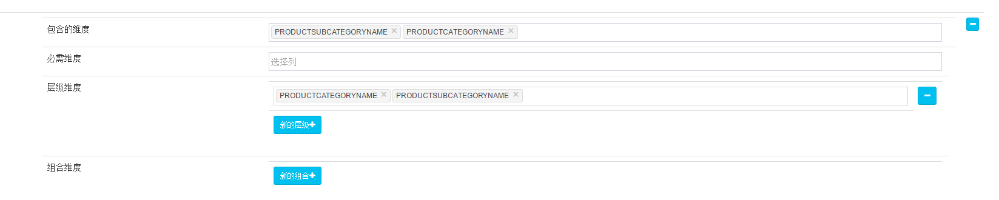

由于参与Cuboid生成的维度都会作为Rowkey，因此我们需要把这些列添加为Rowkey当中。在这个案例中，总共需要添加12个Rowkey。在这里我们直接使用默认设置，不做任何修改。

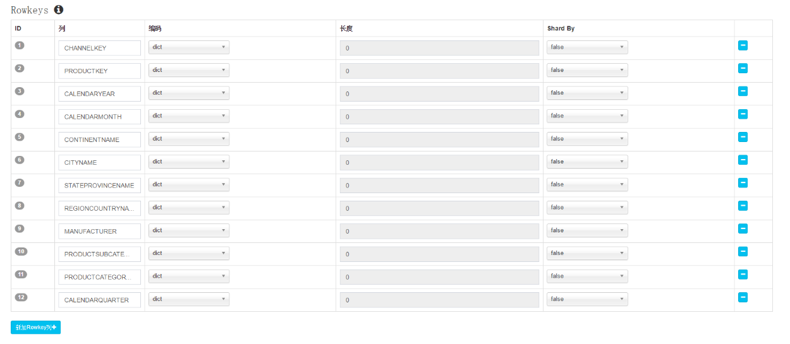

第六步，设置Cube的配置覆盖。在这里添加的配置项可以在Cube级别覆盖从`kylin.properties`配置文件读取出来的全局配置。在这个案例中，我们可以直接采用默认配置，在此不做任何修改。

第七步，对Cube的信息进行概览。请读者仔细确认这些基本信息，包括数据模型名称、事实表以及维度和度量个数。确认无误后单击`保存`按钮，并在弹出的确认提示框中选择`Yes`。

最终，Cube的创建就完成了。我们可以刷新Model页面，在Cube列表中就可以看到新创建的Cube了。因为新创建的Cube没有被构建过，是不能被查询的，所以状态仍然是“禁用”。

 

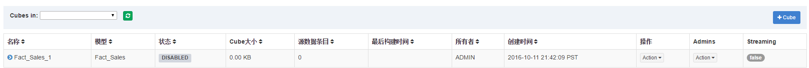

### 构建Cube

第一步，在Cube列表中找到Fact_Sales_1。单击右侧的Action按钮，在弹出的菜单中选择“构建”。

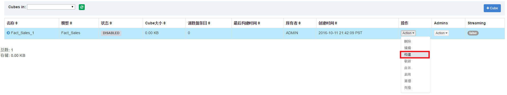 

构建完成后，状态如下图:

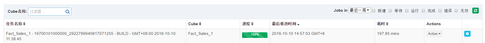

  

### SQL查询

在分析页面对数据进行查询: 

为了查看每个商品种类的销售总额，因此需要输入相应的SQL语句。 

商品种类数据在视图`PRODUCT_PRODUCTSUBCATEGORY`中，销售总额数据在表`FactSales`中。

为了查询销售总额和商品种类，因此在SQL语句中包含`select sum(FACTSALES.SALESAMOUNT), PRODUCT_PRODUCTSUBCATEGORY.PRODUCTCATEGORYNAME`

而视图PRODUCT_PRODUCTSUBCATEGORY与表FACTSALES在模型的创建过程中为内连接，连接条件为`FACTSALES.PRODUCTKEY= PRODUCT_PRODUCTSUBCATEGORY.PRODUCTKEY` 。

因此在SQL语句中包含：`from   FACTSALES INNER JOIN PRODUCT_PRODUCTSUBCATEGORY ON (FACTSALES.PRODUCTKEY =  PRODUCT_PRODUCTSUBCATEGORY.PRODUCTKEY)` 

为了能够使查询结果按商品种类分组，因此在SQL语句中包含：

`group by PRODUCT_PRODUCTSUBCATEGORY.PRODUCTCATEGORYNAME` 

最后SQL语句如下：

```sql
SELECT sum(FACTSALES.SALESAMOUNT),
       PRODUCT_PRODUCTSUBCATEGORY.PRODUCTCATEGORYNAME
FROM FACTSALES
INNER JOIN PRODUCT_PRODUCTSUBCATEGORY ON(FACTSALES.PRODUCTKEY=PRODUCT_PRODUCTSUBCATEGORY.PRODUCTKEY)
GROUP BY PRODUCT_PRODUCTSUBCATEGORY.PRODUCTCATEGORYNAME
```

将其输入查询处，点击`提交` 。查询结果如下图所示：

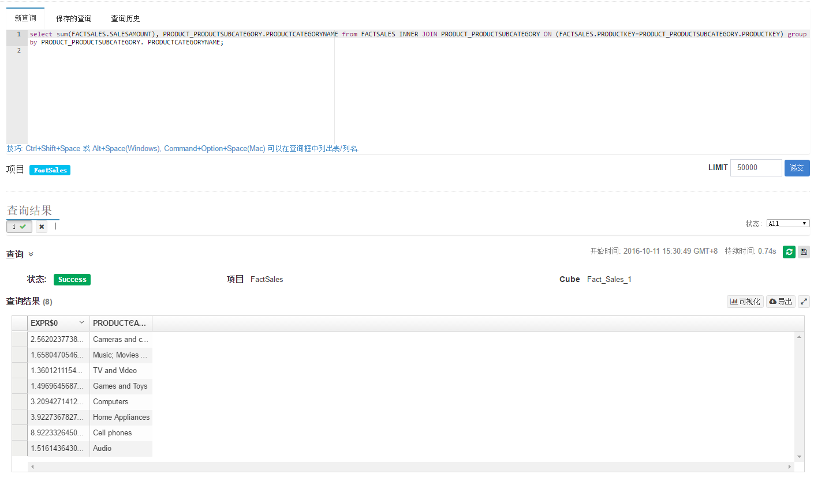

点击`可视化` ，可以以图形化方式更直观的观测数据。

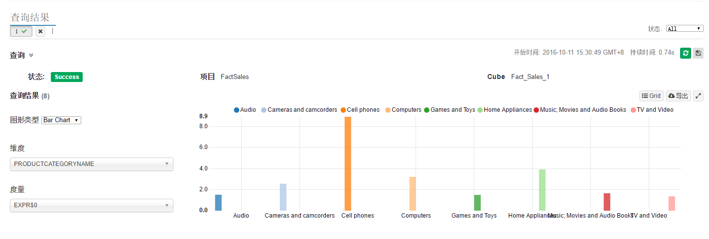

 


根据报表可以看出在所有的产品类别中，`Cell Phone`的销售额远远高于其他产品，`Home Appliances`与`Computer`紧随其后，而`Audio`，`Games and Toys`，`Music;Movies and Audio Books`这四种产品的销售量则相差不大。


## 在KyAnalyzer中制作报表

KyAnalyzer是KAP内置的敏捷式BI平台，允许用户以拖拽的方式自助地制作数据报表，让用户以最简单快捷的方式访问Kylin的数据。

第一步，进入`管理控制台`页面，并从kylin 中同步cube 

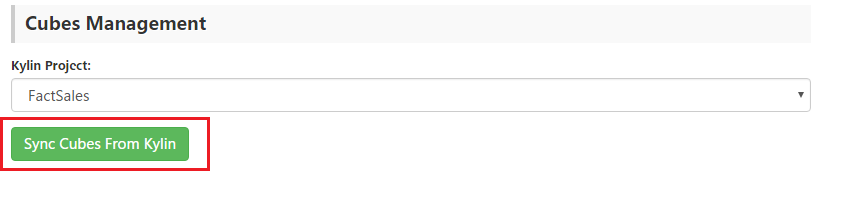

第二步，在`新建查询`中选择已同步的cube

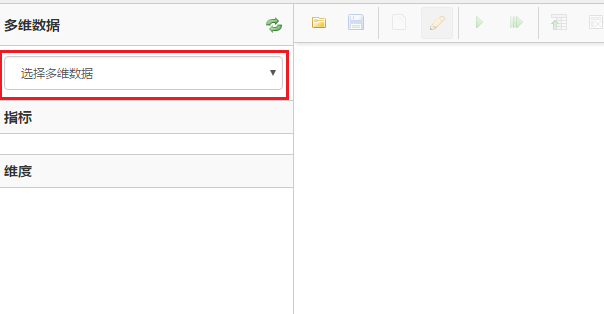

第三步，选择需要的维度和度量进行查询，并生成报表。

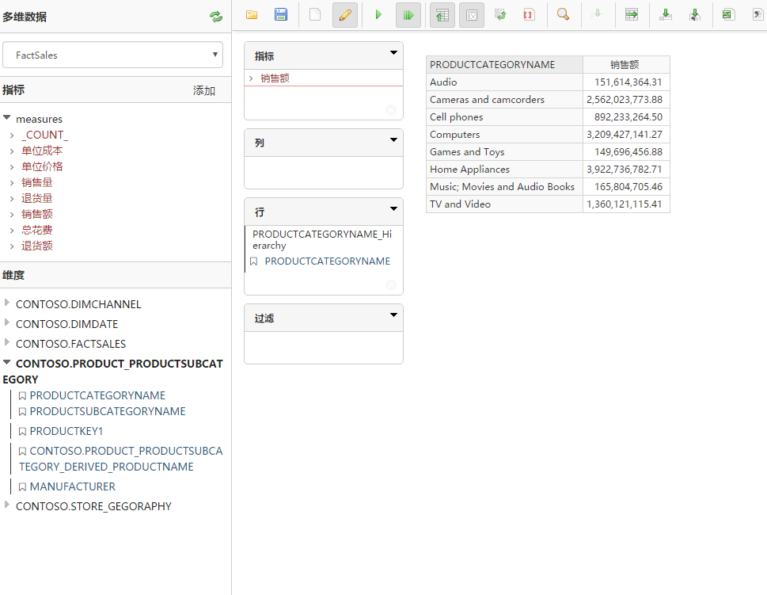

 点击`可视化`，生成图形。

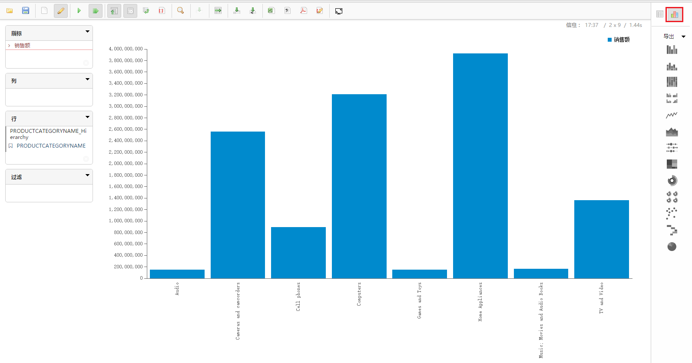


### 制造商的销售，售量，退货分析

```sql
SELECT PRODUCT_PRODUCTSUBCATEGORY.MANUFACTURER,
       sum(FACTSALES.SALESAMOUNT),
       sum(FACTSALES.SALESQUANTITY),
       sum(FACTSALES.RETURNAMOUNT),
       sum(FACTSALES.RETURNQUANTITY),
       sum(FACTSALES.TOTALCOST),
       sum(FACTSALES.SALESAMOUNT)-sum(FACTSALES.RETURNAMOUNT)-sum(TOTALCOST)
FROM FACTSALES
INNER JOIN PRODUCT_PRODUCTSUBCATEGORY ON (FACTSALES.PRODUCTKEY=PRODUCT_PRODUCTSUBCATEGORY.PRODUCTKEY)
INNER JOIN DIMDATE ON (FACTSALES.DATEKEY=DIMDATE.DATEKEY)
WHERE DIMDATE. CALENDARYEAR=2009
GROUP BY PRODUCT_PRODUCTSUBCATEGORY.MANUFACTURER
```

a.维度

  1.PRODUCT_PRODUCTSUBCATEGORY.MANUFACTURER

  2.DIMDATE. CALENDARYEAR

b.度量

  1.FACTSALES.SALESAMOUNT

  2.FACTSALES.SALESQUANTITY

  3.FACTSALES.RETURNAMOUNT

  4.FACTSALES.RETURNQUANTITY

  5.FACTSALES.TOTALCOST

在KyAnalyzer制作报表如下：

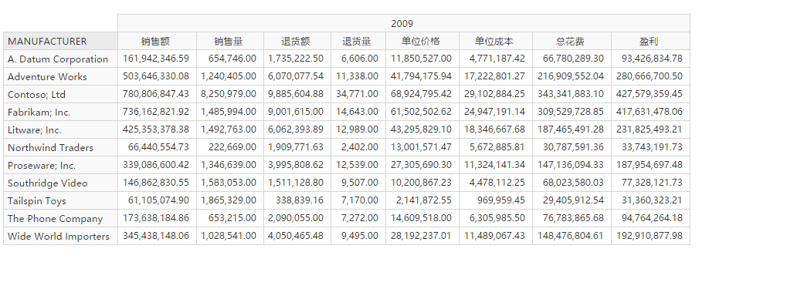

根据报表可以看出在2009年所有制造商中，`Contoso;Ltd`与`Fabrikam;Inc`的盈利远远高于其他制造商，`Adventure Works` 与`Litware;Inc ` 紧随其后，而`Tailspin Toys`则是所有制造商中盈利最少的。


### 每个季度销售量 

```sql
sum(FACTSALES.SALESQUANTITY),
DIMDATE.CALENDARQUARTER
FROM FACTSALES
INNER JOIN DIMDATE ON (FACTSALES.DATEKEY=DIMDATE.DATEKEY)
GROUP BY DIMDATE.CALENDARYEAR,
         DIMDATE.CALENDARQUARTER
```

a.维度

  1.DIMDATE. CALENDARYEAR

  2.DIMDATE. CALENDARQUARTER

b.度量

  1.FACTSALES.SALESQUANTITY

在KyAnalyzer制作报表如下:

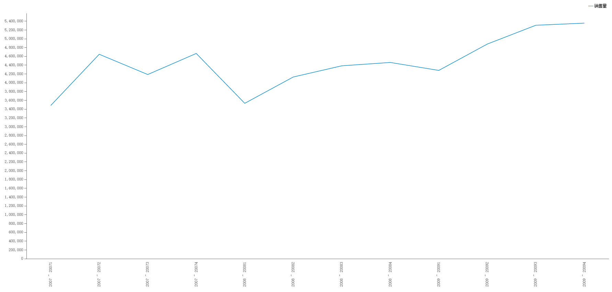

根据报表可以看出在2007年中的销售情况并不稳定，出现波折。而在2008年中出现稳定增长，但幅度较小。在2009年销售额则出现了大幅度增长。

### 商品类别的销售额分析

```sql
SELECT sum(FACTSALES.SALESAMOUNT),
       DIMDATE.CALENDARYEAR, 
       PRODUCT_PRODUCTSUBCATEGORY.PRODUCTCATEGORYNAME
FROM FACTSALES
INNER   JOIN PRODUCT_PRODUCTSUBCATEGORY ON   (FACTSALES.PRODUCTKEY=PRODUCT_PRODUCTSUBCATEGORY.PRODUCTKEY)
INNER JOIN DIMDATE ON  (FACTSALES.DATEKEY = DIMDATE.DATEKEY) 
GROUP BY  PRODUCT_PRODUCTSUBCATEGORY.PRODUCTCATEGORYNAME,
          DIMDATE.CALENDARYEAR
```

a.维度

  1.PRODUCT_PRODUCTSUBCATEGORY.PRODUCTCATEGORYNAME

  2.DIMDATE.CALENDARYEAR

b.度量

  1.FACTSALES.SALESAMOUNT

在KyAnalyzer制作报表如下:

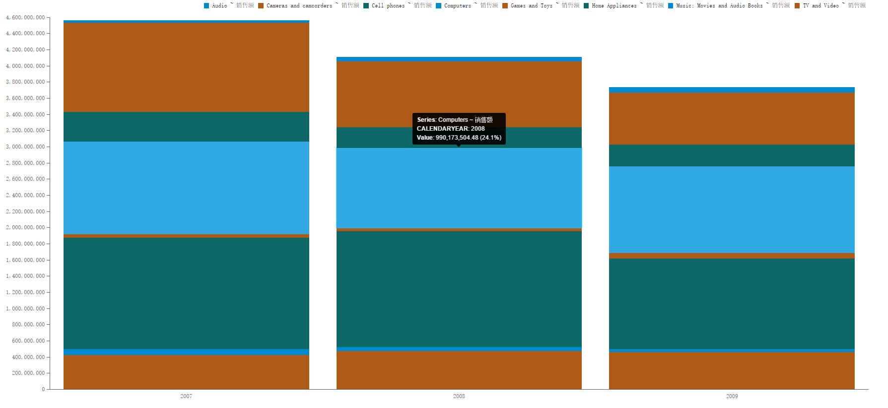

根据报表可以看出销售额逐年下降，而2008年总销售额下降的主要原因是`Cameras and Camcorders`的销量下降，而2009年总销售量下降的主要原因是`Home Appliances`的销量下降。

### 渠道的销售额     

```sql
SELECT sum(FACTSALES.SALESAMOUNT),
       DIMDATE.CALENDARYEAR, 
       DIMCHANNEL.CHANNELNAME
FROM FACTSALES
INNER  JOIN DIMCHANNEL ON (FACTSALES.CHANNELKEY=DIMCHANNEL.CHANNELKEY)
INNER JOIN DIMDATE ON  (FACTSALES.DATEKEY = DIMDATE.DATEKEY) 
GROUP BY DIMDATE.CALENDARYEAR, 
         DIMCHANNEL.CHANNELNAME
```

a.维度

   1.DIMCHANNEL.CHANNELNAME

   2.DIMDATE.CALENDARYEAR

b.度量

   1.FACTSALES.SALESAMOUNT

在KyAnalyzer制作表如下

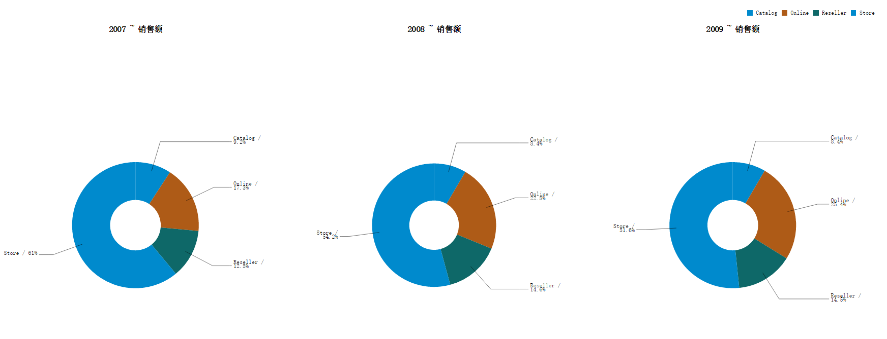

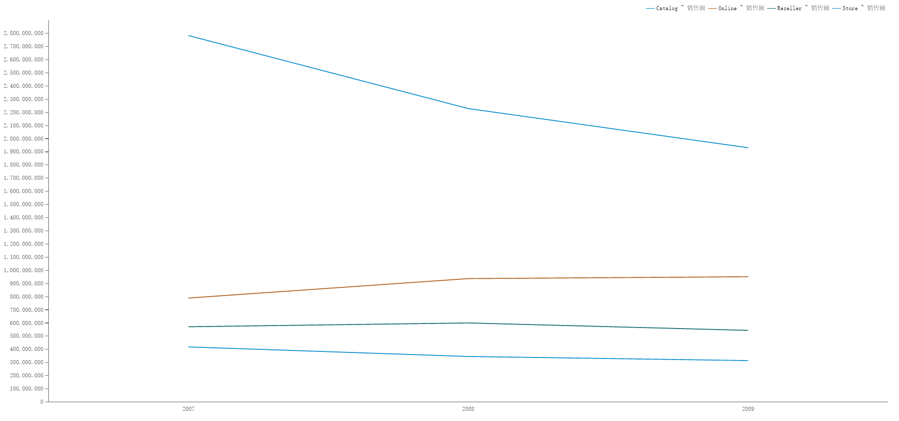

根据报表可以看出在所有的销售渠道中，`Store`的销售额远远高于其他产品，但却逐年大幅度下降。而`Online`，`Reseller`和`Catalog`的销售额则呈现小幅度的波动。

### 洲销售额分析

```sql
SELECT  DIMDATE.CALENDARYEAR,
        STORE_GEGORAPHY.CONTINENTNAME, 
        sum(FACTSALES.SALESAMOUNT)  
FROM  FACTSALES  
INNER JOIN DIMDATE ON  (FACTSALES.DATEKEY = DIMDATE.DATEKEY) 
INNER JOIN STORE_GEGORAPHY ON (FACTSALES.STOREKEY =STORE_GEGORAPHY.STOREKEY) 
GROUP BY DIMDATE.CALENDARYEAR, 
         STORE_GEGORAPHY.CONTINENTNAME
```

a.维度

1. STORE_GEGORAPHY.CONTINENTNAME
2. DIMDATE.CALENDARYEAR

b.度量

​   1.FACTSALES.SALESAMOUNT

在KyAnalyzer制作报表如下:

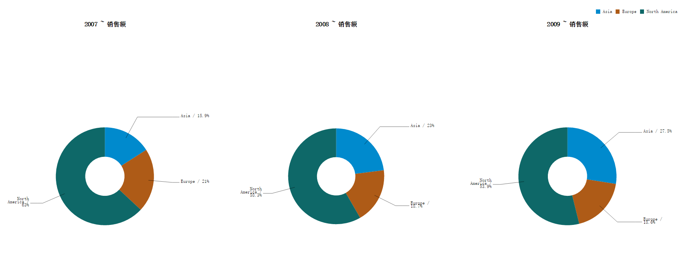

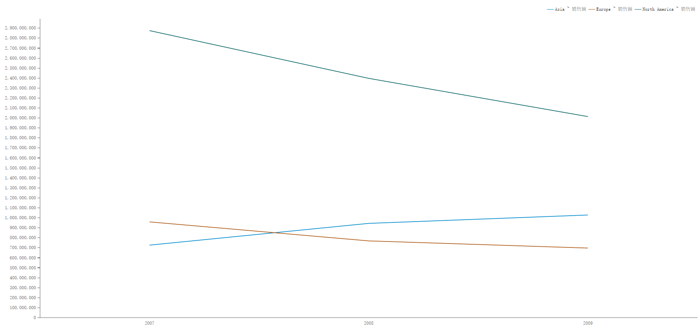

根据报表可以看出在所有的洲之中，在`North America`的销售额远远高于洲，但却逐年大幅度下降，而`Europe`逐年小幅度下降。但`Asia`却开始逐年增长，甚至超过了`Europe`的销售额。


## 总结

经过从获取数据到生成报表的一系列操作，我们对于Kylin（KAP）和KyAnalyzer的使用有了更为明确的了解，更为直观的认识，本文所述只是KAP和KyAnalyzer的一些基本用法。KAP与KyAnalyzer还有一些功能是本文并没有用到的，但也是一些非常实用的功能，例如分区的选择以及RowKey的设置等。这些功能能够帮助你优化Cube。下一步会继续优化Cube的设计，进一步缩短Cube构建时间，降低空间开销，也会继续和大家分享这些心得。

上海跬智信息技术有限公司                                                                                                                                                      [http://kyligence.io](http://kyligence.io/)


作者介绍：陈志雄，Kyligence实习生，吉林大学本科在读。联系我们：info@kyligence.io


参考资料：

Apache Kylin：http://kylin.apache.org 

Kyligence：http://kyligence.io


