# Tutorial for Sales Analytics bases on Apache Kylin

Author：Zhixiong Chen (Kyligence Intern) 

*Reprint please indicate the source, and the original source.*

Contoso is a sample dataset that Microsoft provides as a data analysis study.It simulates a company's sales data.Contoso data sets include sales records, customer information, product details, and more.In this paper,  the data  based on KAP（Kyligence Analytics Platform,Kylin's Enterprise Release）is explored and analyzed.In order to know the sales of each product, analyze sales data for each quarter. and other information.

KAP is consistent with Apache Kylin's modeling process, therefore this example also applies to the Apache Kylin,the Kylin  that  mentioned below is the same meaning with KAP.

[TOC]

## Data Sources 

The data from the Contoso data of the Microsoft public, download link: [http://www.microsoft.com/en-us/download/details.aspx?id=18279](http://www.microsoft.com/en-us/download/details.aspx?id=18279)

Download and extract the file format is `.bak`,need to use SQL Server 2008 to restore the database.After the restore, the data is all stored in SQL Server 2008, from which you can export the datato a CSV file.

The Contoso dataset consists of 26 tables. In this case, to calculate the total sales per product, total sales per quarter,and other information, ,only need to use table `FactSales`, `DimDate`,` DimChannel` `DimGeography`, `DimStore`, `DimProduct`, `DimProductSubcategory`,` DimProductCategory`. Thus deriving the data there in.

Table`FactSales` includes  th information of sales amount, sales quantity, return amount, return quantity, and others .

Table`DimDate` includes  th information of year, quarter, month, and others .

Table`DimChannel`  includes the information of sales channels .

Table`DimGeography`  includes the information of the location of the continent, tate, provinces, cities and others.

Table`DimStore`  includes the information of store name, store phone, store owner and others.

Table`DimProduct`  includes the information of the name of the commodity, the price of goods, the manufacturer of goods and others.

Table`DimProduSubcategory`includes the information of subcategory name.

Table`DimProductCategory`includes the information of category name .

 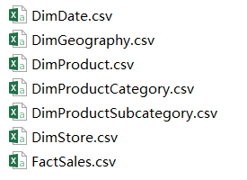 

## Import Hive Data

Kylin supports importing data sources from Hive, so it is required to import these CSV files into the Hive table first.

Step1：Upload `.CSV` files to HDFS

Run the command in  hive:

`hdfs dfs -put FactSales.csv /data/Contoso/FactSales`

Step2:Create a database called `Contoso` in hive.

```sql
create database Contoso
use Contoso
```

Step3：According to the data in the CSV building tables in the hive.

Run the command in  hive:

```sql
CREATE TABLE Contoso.FactSales(
  SalesKey int, 
  DateKey timestamp, 
  ChannelKey int,
  StoreKey int, 
  ProductKey int, 
  PromotionKey int, 
  CurrencyKey int, 
  UnitCost float,
  UnitPrice float, 
  SalesQuantity int, 
  ReturnQuantity int,
  ReturnAmount float, 
  DiscountQuantity int, 
  DiscountAmount float, 
  TotalCost float, 
  SalesAmount float, 
  ETLLoadID int, 
  LoadDate timestamp, 
  UpdateDatetimestamp) 
ROW FORMAT DELIMITED FIELDS TERMINATED BY ',' LOCATION'/data/Contoso/FactSales;
```

 (Where `ROW FORMAT DELIMITED FIELDS TERMINATED BY ','` indicates that the field and the field are separated by "," )

Follow the above command to complete the creation of other tables.

[CreateTable.sql](sql/CreateTable.sql)

Step4：Load the data into a table that was created successfully.

Run the command in  hive:

```
load data local inpath  '/data/Contoso/FactSales/FactSales.csv'  into  table  FactSales;
```

(Indicates that the data in the file  `/data/Contoso/FactSales/FactSales.csv` is loaded into table  `Contoso.FactSales`)

Follow the above command to complete the data loading of other tables.

Step5:Adjust the data model to the star model

In Kylin, only the star model is supported now, but the structure of Contoso is the snowflake model, so we need to do model adjustment.We can adjust the model by creating a view.

Create a view named  `Store_Geography`  based on table `DimStore` and table `DimGeography`.

Create a view named   `ProductSubcategory_ProductCategory`   based on table `DimProductCategoryProduct` and table `DimProductSubcategory`.

Create a view named   `Product_ ProductSubcategory`   based on view `ProductSubcategory_ProductCategory` and table `DimProduct`.

```sql
Create view contoso.Store_Geography AS select 
DimStore.StoreKey, 
DimStore.GeographyKey, 
DimStore.StoreManager, 
DimStore.StoreType, 
DimStore.StoreName, 
DimStore.StoreDescription, 
DimStore.Status, 
DimStore.StorePhone, 
DimStore.StoreFax, 
DimStore.CloseReason, 
DimStore.EmployeeCount, 
DimStore.SellingAreaSize, 
DimGeography.GeographyType, 
DimGeography.ContinentName, 
DimGeography.CityName, 
DimGeography.StateProvinceName, 
DimGeography.RegionCountryName 
from contoso.DimStore inner join contoso.DimGeography onDimStore.GeographyKey = DimGeography.GeographyKey
```

(Indicates that table `contoso.DimGeography` inner join table `contoso.DimStore`，and the connection condition is  `DimStore.GeographyKey   = DimGeography.GeographyKey`)

Follow the above command to complete the creation of other views.

[CreateView.sql](sql/CreateView.sql)

Execute `show tables` to confirm that these tables and views were created successfully  and  the data has been successfully imported.The command is as follows: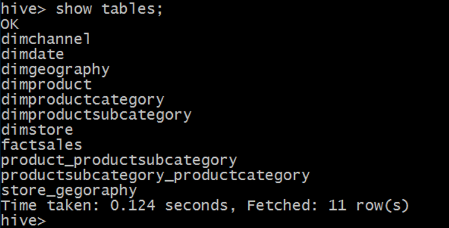

## Build the model in Kylin

The next step is to create the data model in Kylin.

### Create Project

Step1:Create a new project, and named `FactSales` .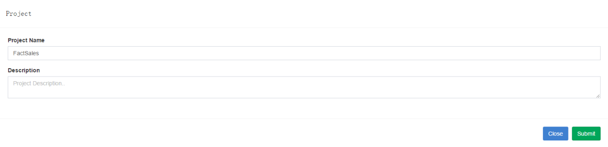

Step2:Select the project you just created.

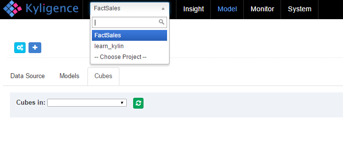

Step3:Synchronize Hive Table

Hive tables need to be synchronized into Kylin before they can be used. To make things easy, we synchronize by `using graphical tree structure to load the Hive table`, as shown below.

 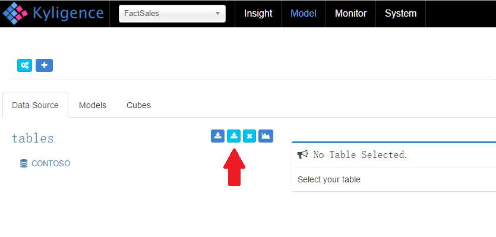

In the dialog box, expand the Contoso database and select the desired five tables.


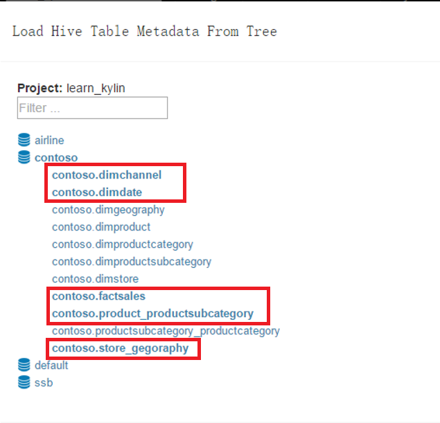

Click the `Sync` button to import the data.

After importing, the system will automatically scan the tables to collect basic statistics of the data. Wait a few minutes, we can view the details under the `Data Source` tab.

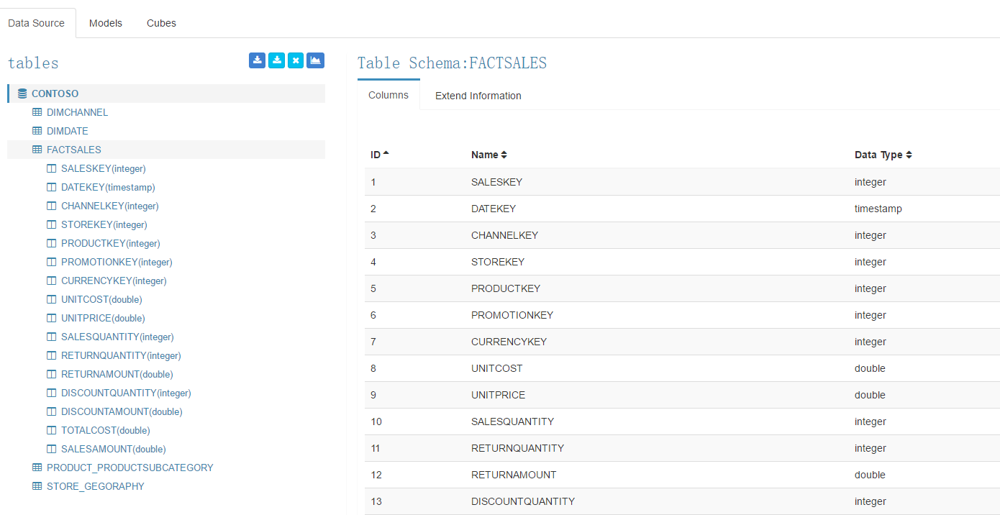

 

### Design Cube:

This is the E-R model of the table that is needed in this case:

Its original data model is the snowflake model:

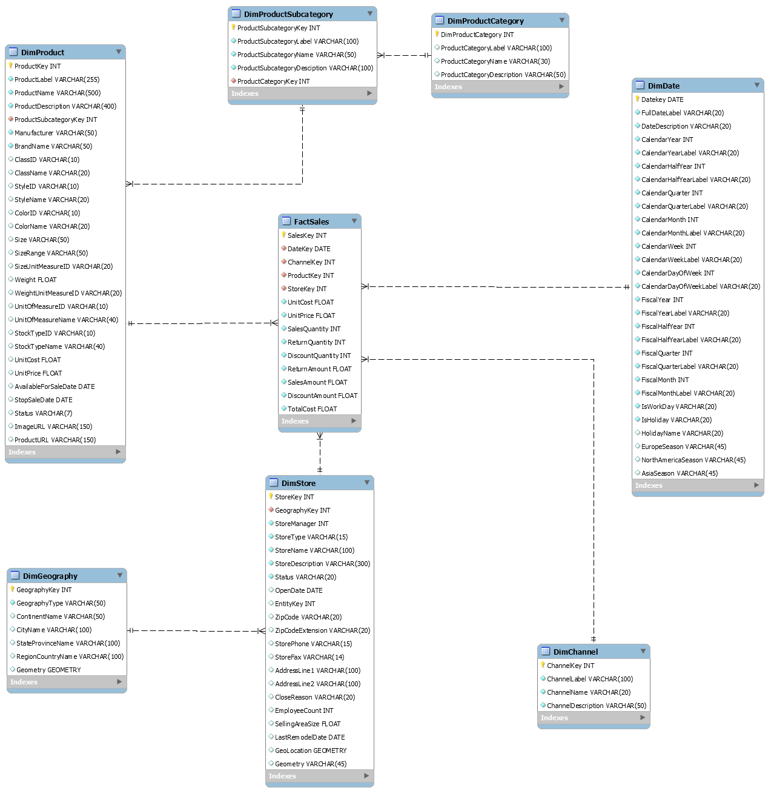

 Currently Kylin only support star model, so we have to adjust the model by creating views. The star model that   adjusted :


In this case,

FactTable  is table `FactSales`

LookupTable  is table `DimDate`,  table `DimChannel`,view  `Store_Geography` and  view  `Product_ ProductSubcategory`。

In order to be able to be grouped according to geographical location,  column `CITYNAME`, `CONTINENTNAME`, `STATEPROVINCENAME`, `REGIONCOUNTRYNAME`  of view `Store_Geography`  is set as  dimension.

In order to be able to group according to date,column `CALENDARYEAR`, `CALENDARQUARTER`  and `CALENDARMONTH`  of table  `DimDate` is set as  dimension.

In order to be able to group according to the sales channel，column `CHANNELNAME`  of table `DimChannel`  is set as  dimension.

In order to be grouped according to the product name and the manufacture,column `PRODUCTSUBCATEGORYNAME`, `MANUFACTURER`,  `PRODUCTCATEGORYNAME` and  `PRODUCTNAME"`  of view `Product_ ProductSubcategory`  is set as  dimension.

Sales in order to be able to pre-calculate the total sales, total sales,column `UNITCOST`, `UNITPRICE`, `SALESAMOUNT`,`RETURNAMOUNT` , `SALESQUANTITY`, `RETURNQUANTITY`, `TOTALCOST` of table FactSales  is set as   measures.

Choose the dimensions and measures as follows:

#### a.Dimension

​    1.DimDate.CALENDARYEAR 

​    2.DimDate.CALENDARQUARTER

​    3.DimDate.CALENDARMONTH

​    4.Store_Geography.CITYNAME

​    5.Store_Geography.CONTINENTNAME

​    6.Store_Geography.STATEPROVINCENAME

​    7.Store_Geography.REGIONCOUNTRYNAME

​    8.DimChannel.CHANNELNAME

​    9.Product_ ProductSubcategory.PRODUCTSUBCATEGORYNAME

​    10.Product_ ProductSubcategory.MANUFACTURER

​    11.Product_ ProductSubcategory.PRODUCTCATEGORYNAME

​    12.Product_ ProductSubcategory.PRODUCTNAME

#### b.Measure

​    1.FactSales.UNITCOST

​    2.FactSales.UNITPRICE

​    3.FactSales.SALESAMOUNT

​    4.FactSales.RETURNAMOUNT

​    5.FactSales.SALESQUANTITY

​    6.FactSales.RETURNQUANTITY

​    7.FactSales.TOTALCOST


### Create Data Model

Select the `FactSales`  project that you just created, and then enter the `model` page, and create a model.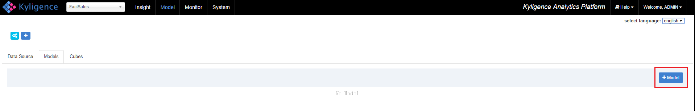

Step1:Enter data model name `Fact_Sale` on info page, then click `Next`.

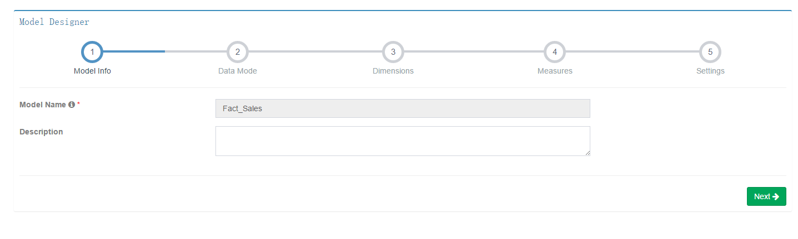

Step2:Select fact table and lookup table for data model.

 (`FactSales`) (`DimDate`, `DimChannel`,`Product_ ProductSubcategory`,`Store_Geography`) for data model according star schema.Set table connect conditions:

And establish connections in FactTable: `FactSales` and LookupTable:`DimDate` ,`DIMCHANNEL`, `DimChannelProduct_ ProductSubcategory`, `Store_Geography`.

DIMCHANNEL

Connect Type：Inner

Connect Condition：`CONTOSO.FACTSALES.CHANNELKEY = CONTOSO.DIMCHANNEL.CHANNELKEY`

STORE_GEGORAPHY

Connect Type：Inner

Connect Condition:` CONTOSO.FACTSALES.STOREKEY= CONTOSO.STORE_GEGORAPHY.STOREKEY`

DIMDATE

Connect Type：Inner

Connect Condition：`CONTOSO.FACTSALES.DATEKEY = CONTOSO.DIMDATE.DATEKEY`

PRODUCT_PRODUCTSUBCATEGORY

Connect Type：Inner

Connect Condition：`CONTOSO.FACTSALES.PRODUCTKEY = CONTOSO.PRODUCT_PRODUCTSUBCATEGORY.PRODUCTKEY`

The result is shown in the following figure.


Step3: Select dimension columns from fact and lookup tables added in previous step. 

In this case, select the dimension according to the design of the cube.

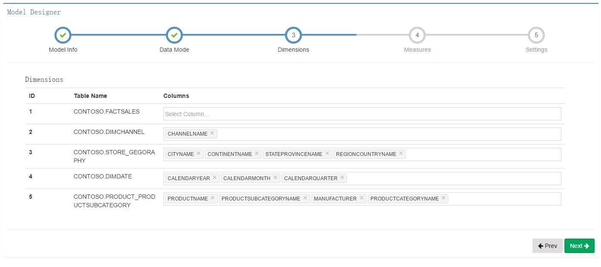

Step4:Select measures from fact table according to business requirement.

In this case, select the measures according to the design of the cube.

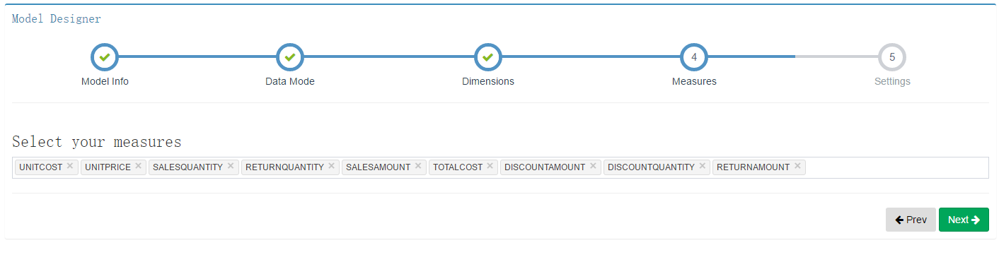

Step5:Select date partition column.

Since this data is not partitioned, no partition is selected.

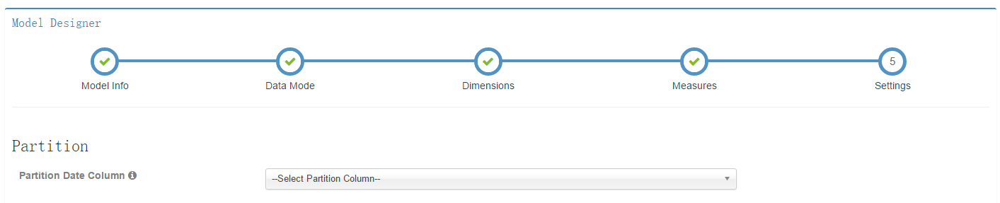

Click the `Save` button to finish creating the Model.

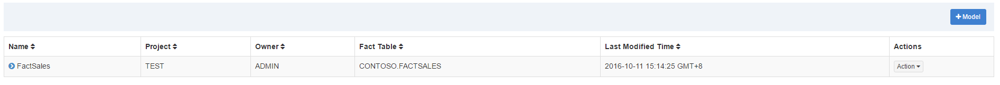

### Create Cube

Step1:Select `Fact_Sales` in `Data Model Name`, enter Cube's name `Fact_Sales_1`. Other fields keep as they are. Click `Next` button.

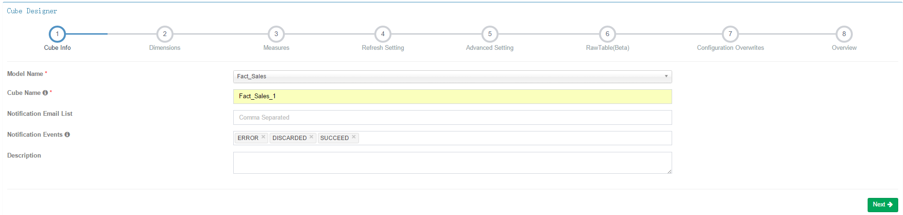

Step2:Select some dimension columns from data model as Cube dimensions.

Click `Add dimension`


 

The   column  `CHANNELNAME` of the table `MCHANNEL` corresponds one-to-one to the primary key `CHANNELKEY` in the table, so it is set to the derivable dimension.

The   column  `PRODUCENAME` of the view `PRODUCT_PRODUCTSUBCATEGORY` corresponds one-to-one to the primary key `PRODUCTKEY` in the table, so it is set to the derivable dimension.

The rest are set to normal dimensions.

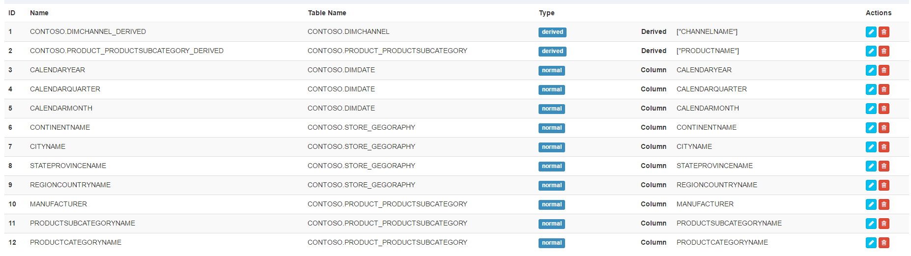


Step3:Define Cube measure types according to aggregation requirements in analysis. 

A COUNT measure is created automatically, which counts the number of orders.

In this case,`SALESAMOUNT`,`SALESQUANTITY`,`TOTALCOST`  are also  important in sales measurements. For example, total sales amount `SUM(SALESAMOUNT)`,total  sales quntity `SUM(SALESQUANTITY)` and total cost `SUM(TOTALCOST)`. Therefore, we manually create seven measure.Select the aggregate expression for SUM and select the `UNITCOST`, `UNITPRICE`,`SALESQUANTITY`,` SALESAMOUNT`,`RETURNQUANTITY`,` RETURNAMOUNT`,` TOTALCOST` column as the destination column.


 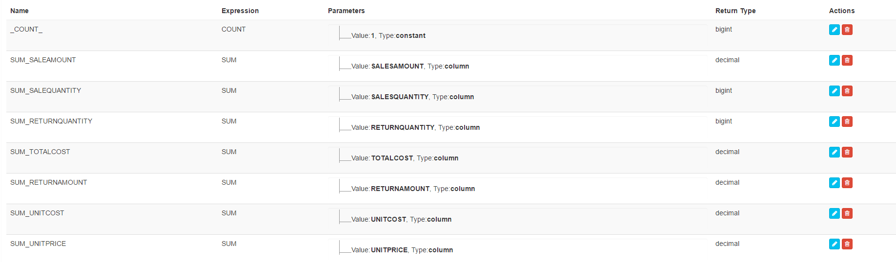

Step4:We configure cube's building and maintain. 

In this case, we don't have the data partition, so here we directly use the default Settings, not making any changes.


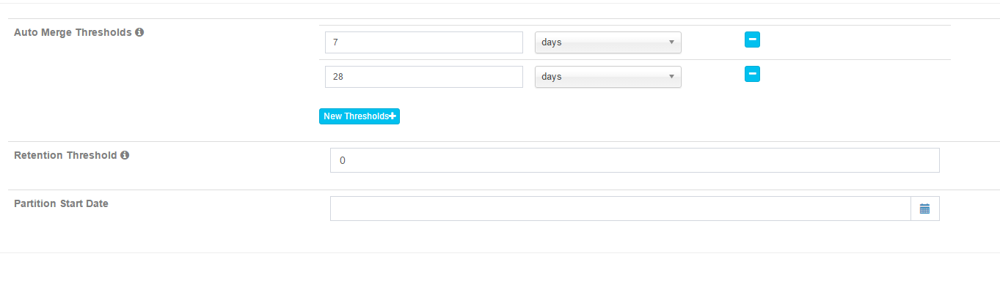

Step5:  Optimize Cube's storage size and query speed through Cube's advanced settings, including aggregation group and Rowkey. 

`CALENDARYEAR`, `CALENDARQUARTER`  and  `CALENDARMONTH`  in the dimension represents year, quarter, and month.

They are hierarchical, so choose `CALENDARYEAR`,`CALENDARQUARTER`  and `CALENDARMONTH`  in the hierarchy dimension in order.


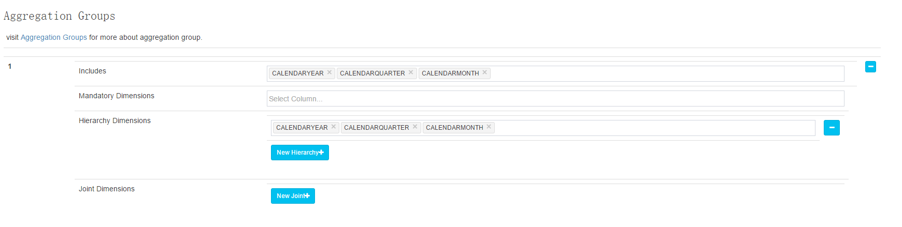

`CONTINENTNAME`, `REGIONCOUNTRYNAME`,  `STATEPROVINCENAME`   and  ` CITYNAME`  in the dimension represents continents, states, provinces, and cities.

They are hierarchical, so choose `CONTINENTNAME`, `REGIONCOUNTRYNAME`, `STATEPROVINCENAME`  and `CITYNAME`  in the hierarchy dimension in order.

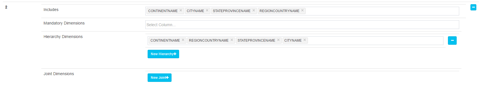

`PRODUCTCATEGORYNAME` and  ` PRODUCTSUBCATEGORYNAME`  in the dimension represents the product category and the sub-category of the product

They are hierarchical, so choose `PRODUCTCATEGORYNAME`and `PRODUCTSUBCATEGORYNAME`  in the hierarchy dimension in order.

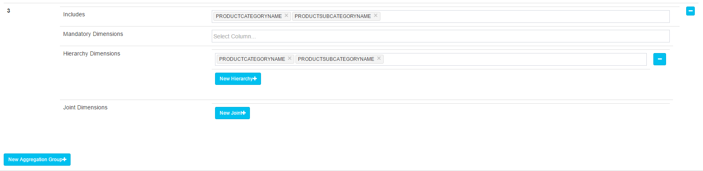

Because all dimensions are included in Rowkey of Cuboid, they should be added in Rowkey field. In this case, total 12 dimensions are added. 

Here we use the default settings directly, without making any changes.

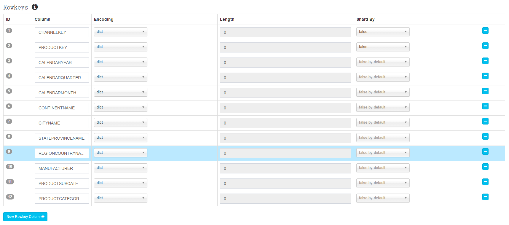

Step6:Set Cube configuration override. The configuration added here can override the global ones read from file `kylin.properties`. We don't change any configuration in this case. 

Step7:Cube information overview. Please read the information carefully. Click `Save` button if everything is good. Then click `Yes` button in pop-up menu. 


Finally Cube creation is done. The new Cube will be shown in Cube list in refreshed Model page. The state of the Cube is disable for that it has not been built.


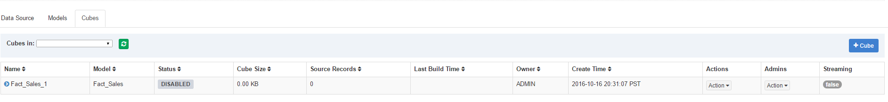

### Build Cube

Step1:Find the `Fact_Sales_1` cube, right click the `Action` button, and select `Build` in the drop-down menu.


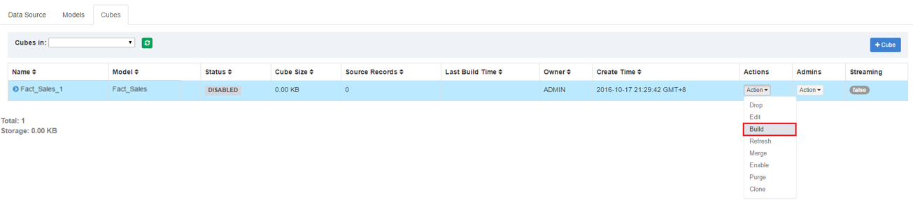 

After the completion of the building, the state is as follows:

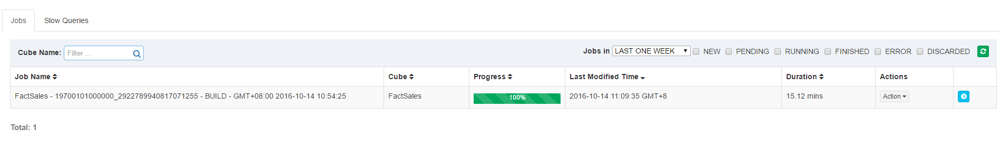

  

### SQL Query

Query the data in the `Insight` page:

In order to view the total sales of each product category, it is required to enter the corresponding SQL statement.

Product type data in the view`PRODUCT_PRODUCTSUBCATEGORY`，total sales amount data  in table `FactSales`中。

In order to query the total sales and product categories, the SQL statement contains`select sum(FACTSALES.SALESAMOUNT), PRODUCT_PRODUCTSUBCATEGORY.PRODUCTCATEGORYNAME`

VIew `PRODUCT_PRODUCTSUBCATEGORY` and table `FACTSALES` are inner join during the creation of the model,The connection condition is`FACTSALES.PRODUCTKEY= PRODUCT_PRODUCTSUBCATEGORY.PRODUCTKEY`

The SQL statement contains`from   FACTSALES INNER JOIN PRODUCT_PRODUCTSUBCATEGORY ON (FACTSALES.PRODUCTKEY =  PRODUCT_PRODUCTSUBCATEGORY.PRODUCTKEY)` 

In order to group the query results by product type,the SQL statement contains

`group by PRODUCT_PRODUCTSUBCATEGORY.PRODUCTCATEGORYNAME` 

The final SQL statement is as follows:

```sql
SELECT sum(FACTSALES.SALESAMOUNT),
       PRODUCT_PRODUCTSUBCATEGORY.PRODUCTCATEGORYNAME
FROM FACTSALES
INNER JOIN PRODUCT_PRODUCTSUBCATEGORY ON(FACTSALES.PRODUCTKEY=PRODUCT_PRODUCTSUBCATEGORY.PRODUCTKEY)
GROUP BY PRODUCT_PRODUCTSUBCATEGORY.PRODUCTCATEGORYNAME
```

Enter the query, click `submit`.Query results as shown below:

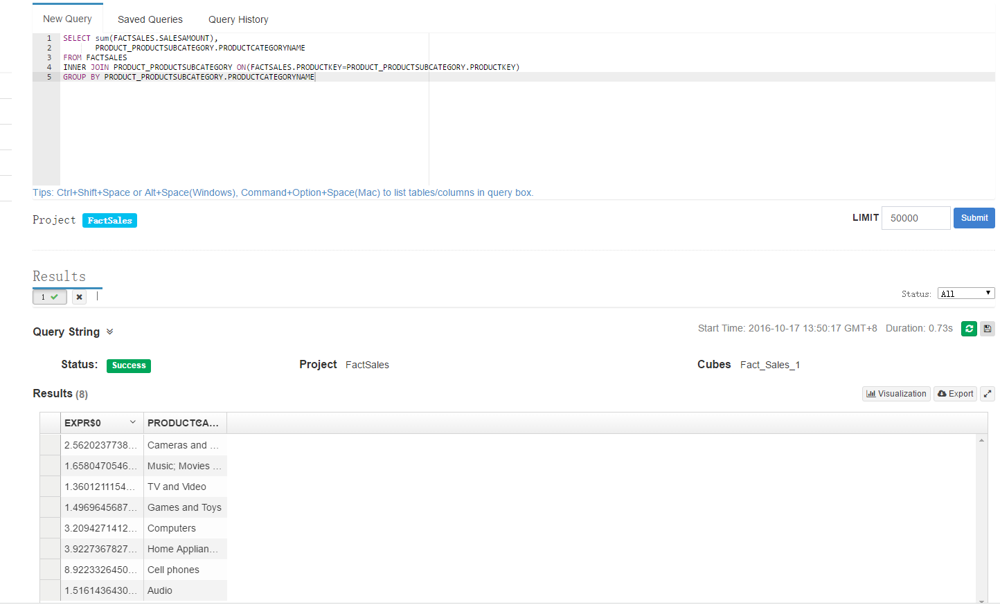

Click `Visualization`  to visualize the data in a graphical way.

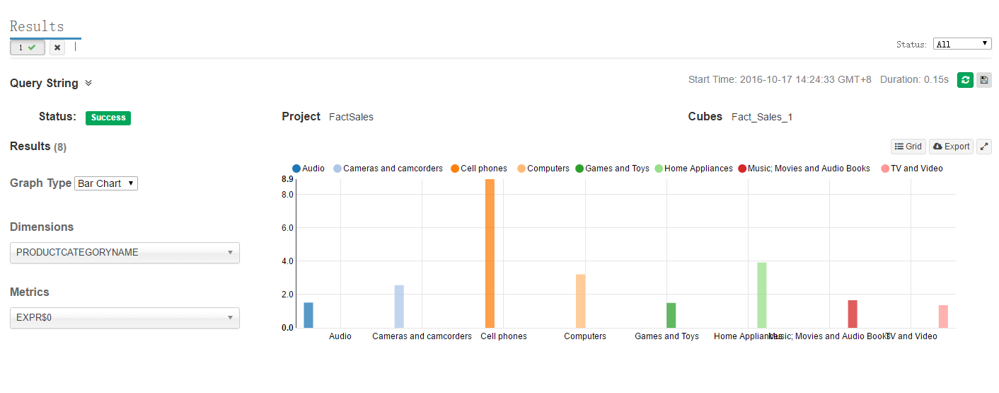

 


 


According to the report you can see in the category of all products, sales amount of `Cell Phone`  is much higher than other products, `Home Appliancess` is the second .And the sales amount of `Audio`,` Games and Toys `and` Music; Movies and Audio Books` are similar.


## Create a report in KyAnalyzer

KyAnalyzer is KAP's built-in agile BI platform that allows users to create data reports in a drag-and-drop way,allowing users to access KAP data in the simplest and most convenient way.

Step1:Enter `Admin Console`  page,and Synchronizecube from kylin.

Step2:Select the synchronized cube in the `New query` page.

 

Step3:Select the required dimensions and measures for querying, and generate reports

Click to `visualize`, generate graphics

### Total sales  amout, total sales quantity, total return amount, etc  of  each manufacturer:

```sql
SELECT PRODUCT_PRODUCTSUBCATEGORY.MANUFACTURER,
       sum(FACTSALES.SALESAMOUNT),
       sum(FACTSALES.SALESQUANTITY),
       sum(FACTSALES.RETURNAMOUNT),
       sum(FACTSALES.RETURNQUANTITY),
       sum(FACTSALES.TOTALCOST),
       sum(FACTSALES.SALESAMOUNT)-sum(FACTSALES.RETURNAMOUNT)-sum(TOTALCOST)
FROM FACTSALES
INNER JOIN PRODUCT_PRODUCTSUBCATEGORY ON (FACTSALES.PRODUCTKEY=PRODUCT_PRODUCTSUBCATEGORY.PRODUCTKEY)
INNER JOIN DIMDATE ON (FACTSALES.DATEKEY=DIMDATE.DATEKEY)
WHERE DIMDATE. CALENDARYEAR=2009
GROUP BY PRODUCT_PRODUCTSUBCATEGORY.MANUFACTURER
```

a.Dimensions

  1.PRODUCT_PRODUCTSUBCATEGORY.MANUFACTURER

  2.DIMDATE. CALENDARYEAR

b.Measure

  1.FACTSALES.SALESAMOUNT

  2.FACTSALES.SALESQUANTITY

  3.FACTSALES.RETURNAMOUNT

  4.FACTSALES.RETURNQUANTITY

  5.FACTSALES.TOTALCOST

In KyAnalyzer making report are as follows:

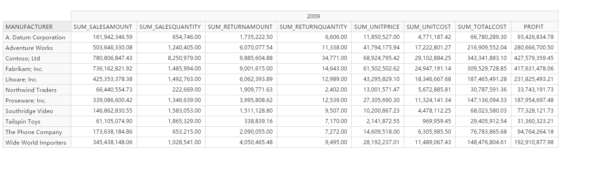

According to the report can be seen in all manufacturers in 2009,` Contoso; Ltd `'s profit  and `Fabrikam; Inc`'s profit  is much higher than other manufacturers.And the profit of `The Phone Company`and`A. Datum Corporation` is similar.The`Tailspin Toys` is the least profitable manufacturers of all.

### Total sales amount and total returns amount  of  each quarter:

```sql
sum(FACTSALES.SALESQUANTITY),
DIMDATE.CALENDARQUARTER
FROM FACTSALES
INNER JOIN DIMDATE ON (FACTSALES.DATEKEY=DIMDATE.DATEKEY)
GROUP BY DIMDATE. CALENDARYEAR,
         DIMDATE. CALENDARQUARTER
```

a.Dimensions

  1.DIMDATE. CALENDARYEAR,

  2.DIMDATE. CALENDARQUARTER

b.Measure

  1.FACTSALES.SALESQUANTITY

In KyAnalyzer making report are as follows:


According to the report can be seen in 2007 of the sales situation is not stable, there are twists and turns.And in 2008 there was a steady growth, but the smaller. In 2009 there was a substantial increase in sales.

### Total sales  amount of each product category:

```sql
SELECT sum(FACTSALES.SALESAMOUNT),
       DIMDATE.CALENDARYEAR, 
       PRODUCT_PRODUCTSUBCATEGORY.PRODUCTCATEGORYNAME
FROM FACTSALES
INNER   JOIN PRODUCT_PRODUCTSUBCATEGORY ON   (FACTSALES.PRODUCTKEY=PRODUCT_PRODUCTSUBCATEGORY.PRODUCTKEY)
INNER JOIN DIMDATE ON  (FACTSALES.DATEKEY = DIMDATE.DATEKEY) 
GROUP BY  PRODUCT_PRODUCTSUBCATEGORY.PRODUCTCATEGORYNAME,
          DIMDATE.CALENDARYEAR
```

a.Dimensions

  1.PRODUCT_PRODUCTSUBCATEGORY.PRODUCTCATEGORYNAME

  2.DIMDATE.CALENDARYEAR

b.Measure

  1.FACTSALES.SALESAMOUNT

 

In KyAnalyzer making report are as follows:


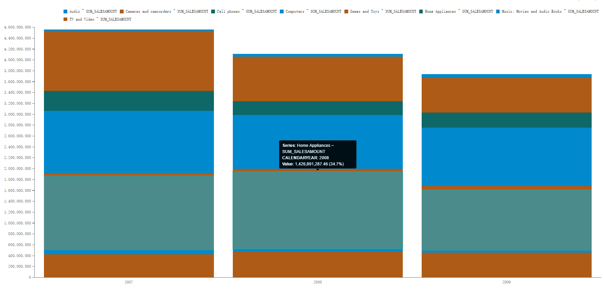

According to the report we can see that the sales decline year by year.The main reason for the decline in total sales in 2008 was `Cameras and Camcorders` sales decline.The main reason for the decline in total sales in 2009 was `Home Appliances` sales decline.


### Total sales  amount of each channel:

```sql
SELECT sum(FACTSALES.SALESAMOUNT),
       DIMDATE.CALENDARYEAR, 
       DIMCHANNEL.CHANNELNAME
FROM FACTSALES
INNER  JOIN DIMCHANNEL ON (FACTSALES.CHANNELKEY=DIMCHANNEL.CHANNELKEY)
INNER JOIN DIMDATE ON  (FACTSALES.DATEKEY = DIMDATE.DATEKEY) 
GROUP BY DIMDATE.CALENDARYEAR, 
         DIMCHANNEL.CHANNELNAME
```

a.Dimensions

   1.DIMCHANNEL.CHANNELNAME

   2.DIMDATE.CALENDARYEAR

b.Measure

   1.FACTSALES.SALESAMOUNT

In KyAnalyzer making report are as follows:

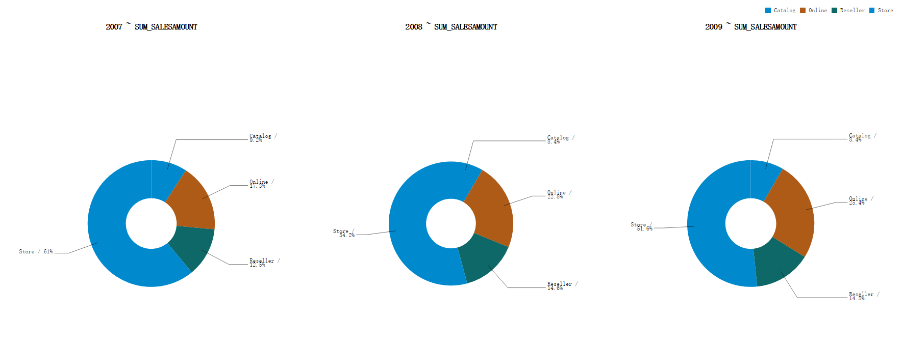


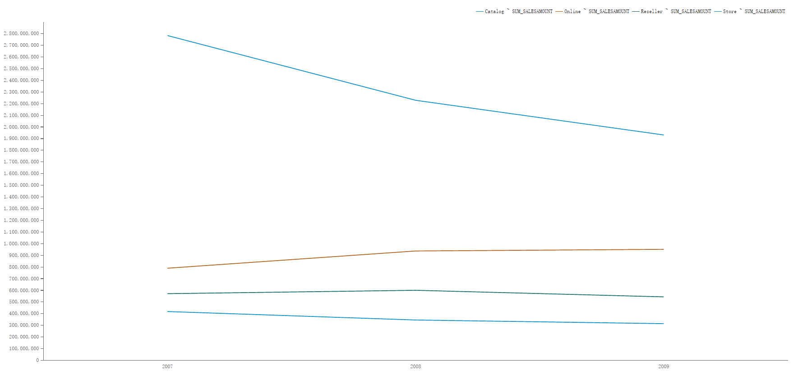

According to the report can be seen in all sales channels, the `Store`'s sales is much higher than other products, but has dropped substantially. While `Online`'s, `Reseller`'s  and `Catalog` 's  sales are small fluctuations.


### Total sales  amount of each continent:

```sql
SELECT  DIMDATE.CALENDARYEAR,
        STORE_GEGORAPHY.CONTINENTNAME, 
        sum(FACTSALES.SALESAMOUNT)  
FROM  FACTSALES  
INNER JOIN DIMDATE ON  (FACTSALES.DATEKEY = DIMDATE.DATEKEY) 
INNER JOIN STORE_GEGORAPHY ON (FACTSALES.STOREKEY =STORE_GEGORAPHY.STOREKEY) 
GROUP BY DIMDATE.CALENDARYEAR, 
         STORE_GEGORAPHY.CONTINENTNAME
```

a.Dimensions

1. STORE_GEGORAPHY.CONTINENTNAME
2. DIMDATE.CALENDARYEAR

b.Measure

​   1.FACTSALES.SALESAMOUNT

In KyAnalyzer making report are as follows:

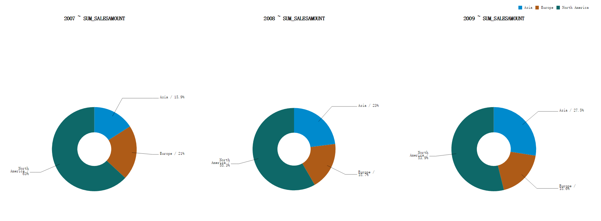

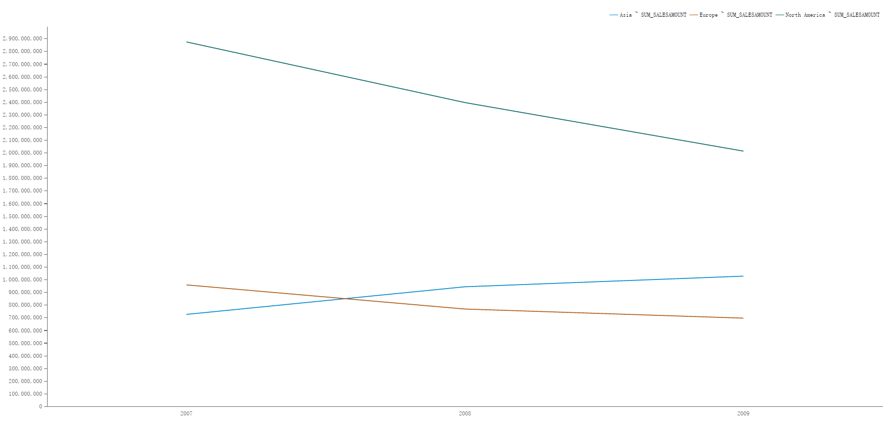

According to the report can be seen in all continents, sales in North America is much higher than other continents, but a substantial decline year by year. Europe declined slightly year by year.But Asia has begun to grow year by year, even more than Europe's sales.

## Conclusion

After a series of operation from to get the data to generate reports,we have a clearer  and more intuitive understanding  of the use of Kylin(KAP) and KyAnalyzer 。This article is only some basic usage of KP and KyAnalyzer.KPA and KyAnalyzer also have some features that are not used in this article, but  them  are also  very useful features, such as partition selection and RowKey settings.These features can help you optimize the Cube.The next step will continue to optimize the design of the Cube, to further reduce the Cube build time, reduce the space overhead, and we  will continue to share these experiences.


 2016 Kyligence Inc.                                                                                                                                            [http://kyligence.io](http://kyligence.io/)

Author: Zhixiong Chen, Kyligence intern,the student he is an undergraduate in Jilin University now.

Contact us:info@kyligence.io


References:

Apache Kylin：http://kylin.apache.org 

Kyligence：http://kyligence.io