#Twitter热词分析：基于Apache Kylin的Streaming建模示例
作者：谢凡（Kyligence实习生）
注：转载请注明出处，原文及来源

*Apache Kylin* 1.6.0引入了新的流式计算（streaming）特性，新特性具体介绍见（[New NRT Streaming in Apache Kylin](http://kylin.apache.org/blog/2016/10/18/new-nrt-streaming)）。Streaming特性目前是beta阶段，但它已经可以为用户提供利用Kylin进行实时数据分析的能力，用户可以将Kafka作为数据源，实时读取流式数据到Kylin，并以分钟（3到5分钟）为间隔实时构建数据立方体。

本文将以Twitter的实时数据为基础，一步步教用户如何利用Twitter API读取Twitter消息并写入Kafka，利用Kylin从Kafka读取流式数据并实时构建数据立方体，最后利用前端报表框架实时地进行Twitter热点数据的分析展示。

本Demo介绍的方法是比较通用的方法，文中介绍的方法对于除Twitter以外的其他类型的实时数据源，比如微博数据、股票数据等，也有很好的适用性，需要分析其他实时数据的用户也可以根据此Demo进行修改，进行其他数据源的分析。

[TOC]

## 数据来源
数据来源于Twitter公开的采样数据，通过Twitter API实时获取最新的消息。

###创建Twitter App

要消费Twitter的消息，首先需要获得Twitter的官方许可，这需要通过创建一个Twitter App的方式实现，通过以下link：https://apps.twitter.com/app/new 可以创建TwitterAPP

创建成功之后，会获得相关授权的*comsumer key*，这些*consumer key*会用在代码中，Twitter对每个应用都分配了一定的流量限额，允许最多一个进程消费，过多的连接会引起连接断开，甚至封IP，每秒钟大概消费70条数据。

创建成功如下图：

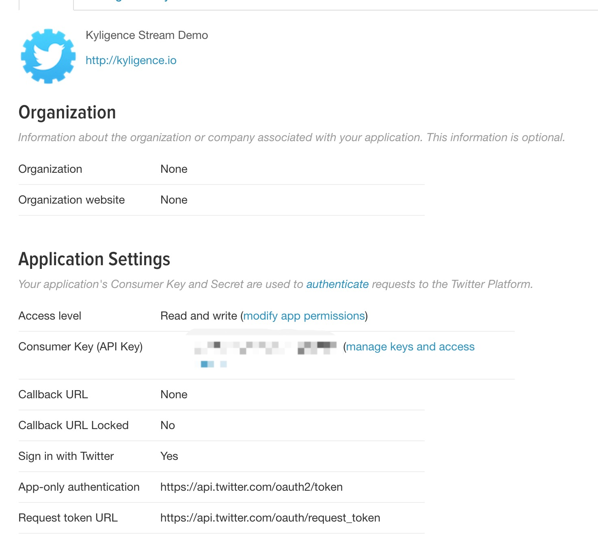

###利用Twitter API实时读取Twitter数据

首先，需要准备安装好Kafka环境的服务器若干台，启动Kafka服务器（Broker）并创建对应的Topic(Kafka相关教程请见[Kafka官网](http://kafka.apache.org/documentation))。笔者在制作本教程的时候，使用的是亚马逊云平台（AWS）上面的3台Kafka Broker服务器。（Kafka建议大家使用0.10-scala2.10版本，同时，Kylin1.6.0对于Kafka0.8及以前的版本是不支持的）


Twitter暴露了一组API，详见：https://dev.twitter.com/overview/api 在本例中，我们使用了Streaming API中的sample API https://dev.twitter.com/streaming/reference/get/statuses/sample 我们并没有直接使用这些REST API，而是采用了更易用的[Twitter4j SDK](http://twitter4j.org/)封装，关键代码参考[PrintSampleStream.java](https://github.com/yusuke/twitter4j/blob/master/twitter4j-examples/src/main/java/twitter4j/examples/stream/PrintSampleStream.java)

我们需要写一个简单的Java程序，用于从Twitter API读取数据并且写入到Kafka。程序会将消息分别写入到两个不同的主题中：*TwitterDemo*和*TWITTER_TAG_STREAM2*）。其中*TwitterDemo*用于处理原始的Twitter流消息，也可以用于性能和功能测试，*TWITTER_TAG_STREAM2*中的消息是由原始Twitter消息经过过滤和加工，提取出对分析有用的信息（设备、语言、热词等）而组成，本文中主要就是运用到了这个topic中的消息。

Java程序主要代码如下
```java
public static void main(String[] args) throws Exception{
        // 本程序基于Spring Boot SDK
        ApplicationContext context = SpringApplication.run(TwitterDemo2.class);
        // KafkaSettings是例子中的配置信息读取类
        final KafkaSettings kafkaSettings = context.getBean(KafkaSettings.class);
        Properties prop = new Properties();
        // 设置kafka broker地址
        prop.put("bootstrap.servers", kafkaSettings.getBrokers());
        prop.put("acks", "0");
        prop.put("value.serializer", StringSerializer.class.getCanonicalName());
        prop.put("key.serializer", StringSerializer.class.getCanonicalName());
        // 第一个topic用于存储Twitter的原始数据，未在这篇文章中使用，读者可以忽略
        final String topic = "TwitterDemo";
        // 第二个topic用于热词等结构化数据，将Twitter原油的JSON树形结构，转变为表的结构。
        final String topic2 = "TWITTER_TAG_STREAM2";
        final KafkaProducer<String, String> kafkaProducer = new KafkaProducer<String, String>(prop);
        // 放大因子，这是用来模拟消息放大量的参数因子，读者可以忽略
        final int factor = kafkaSettings.getFactor();
        final Gson gson = new Gson();
        StatusListener listener = new StatusListener() {
            // 收到新的Twitter消息
            public void onStatus(Status status) {
                for(int i=0;i<factor;i++){
                    kafkaProducer.send(new ProducerRecord<String, String>(topic, null, gson.toJson(status)));
                    // 提取消息中的HashTag字段，并扁平化处理
                    HashtagEntity[] tags = status.getHashtagEntities();
                    if(tags != null && tags.length != 0){
                        for(HashtagEntity tag : tags){
                            // 每一个HashTag抽取成一条TwitterTuple
                            TwitterTuple tuple = new TwitterTuple(status);
                            tuple.setHashTag(tag.getText());
                            kafkaProducer.send(new ProducerRecord<String, String>(topic2, null, gson.toJson(tuple)));
                        }
                    }
                }
            }
            public void onDeletionNotice(StatusDeletionNotice statusDeletionNotice) {
            }
            public void onTrackLimitationNotice(int numberOfLimitedStatuses) {
            }
            public void onScrubGeo(long l, long l1) {
            }
            public void onStallWarning(StallWarning stallWarning) {
            }
            public void onException(Exception ex) {
                ex.printStackTrace();
            }
        };
        TwitterStream twitterStream = new TwitterStreamFactory().getInstance();
        twitterStream.addListener(listener);
        // sample() method internally creates a thread which manipulates TwitterStream and calls these adequate listener methods continuously.
        twitterStream.sample();
    }
```


程序首先配置好Kafka相关参数，然后创建了一个`StatusListener`用于监听Twitter消息流，当Twitter消息到达时，就会回调`void onStatus(Status status)`方法获得接收到的Twitter消息。得到Twitter消息后，可以对消息进行处理，提取出自己需要的字段。在本例子中，我们提取出了Twitter消息中id、语言、发送设备、点赞数、被转发数、时区、热点词等字段，并且以JSON格式序列化成消息通过`KafkaProducer`发送到`KafkaBroker`中，为接下来使用*Apache Kylin*构建数据立方体做准备。

程序运行成功后，可以用`kafka-console-consumer.sh`读取消息到控制台。
```json
{
    "id": 794085124220457000, 
    "createdAt": "Nov 3, 2016 7:53:41 AM", 
    "source": "Twitter for Android", 
    "favoriteCount": 0, 
    "retweetCount": 0, 
    "lang": "it", 
    "hashTag": "Montella"
}
```


这里部署了*Kafka Manager*，用于监控Kafka流量，在*Kafka Manager*中看到如下信息

从监控中可以看到，Twitter消息流已经产生了。


## 在Apache Kylin中构建模型
上一步中，我们将利用TwitterAPI读取采样的Twitter消息并将消息中我们需要的字段提取出来后以JSON格式导入到了Kafka中。这一步，我们将利用Kylin的WebUI来创建数据模型、定义Cube并进行定时的Cube构建。这里假设读者在之前已经有一定的Cube构建基础，如果您从来没有构建过简单的Cube，建议您先参考这两篇文章：

[Quick Start with Sample Cube](http://kylin.apache.org/docs15/tutorial/kylin_sample.html)      

[Scalable Cubing from Streaming (Kafka)](http://kylin.apache.org/docs16/tutorial/cube_streaming.html)

### 配置Kafka数据源
登录到Kylin WebUI，在Data Source一栏中，选择Add Streaming Table选项
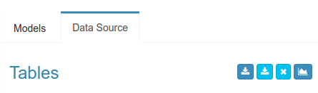


Kylin将自动识别JSON文件的格式来定义Kafka中的消息格式，使用者需要提供一个JSON格式的样本数据。


定义Kafka集群配置信息。目前集群的配置是在每个Streaming Table中，并不是全局配置。
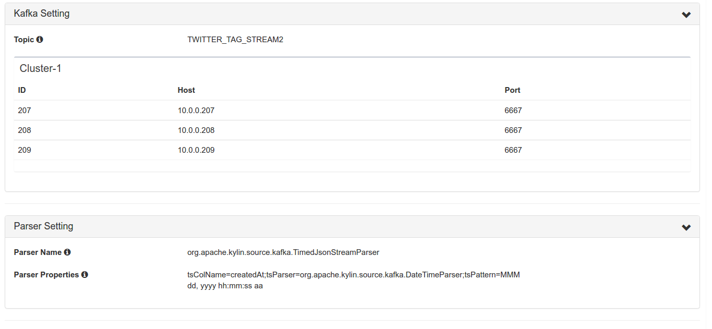
###数据模型设计分析
在本demo中，我们共需要实现三种不同的功能：

1、用Twitter消息对KYLIN的streaming特性进行功能测试和压力测试 

2、实现热点消息的统计 

3、对于某个热点消息，查询其在一定时间范围内的热度变化情况

因此，我们需要定义三个不同的cube。当然，实际上我们也可以用一个model和cube实现这三项功能。这里将他们划分成三个，一个是为了在概念上更加清晰，另外也是为了更为节省空间。接下来，我们会详细介绍实现后两项功能的cube的设计过程。


#### 定义model
在Models一栏中选择New-->New Model创建新的模型定义


命名model，本例中model命名为TWITTER_TAG_DEMO_MODEL
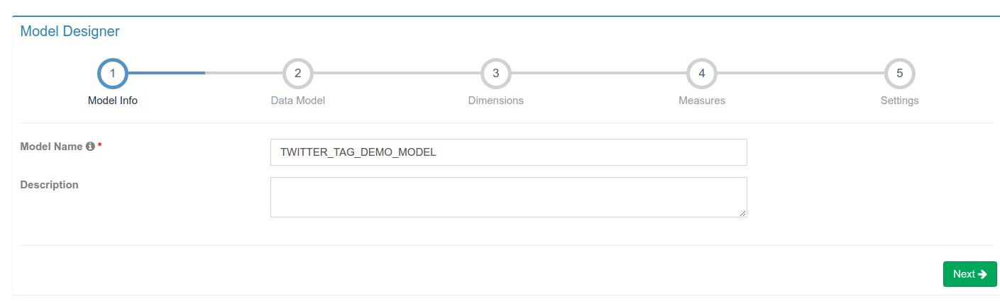

选择事实表（注意Kylin的Streaming暂时还不支持Lookup Table，因此不要选择Lookup Table选项）


选择需要的Dimensions。这里我们主要选出对之后分析数据有用的维度，包括设备、语言、时间、热点词等。(小tips：在定义model时，dimensions可以稍微多选择一些，由于在定义Cube时还需要具体定义需要的dimensions，没有被cube用到的dimensions并不会影响构建和查询的性能)


选择需要的measures。注意，在Apache Kylin 1.6中，为了让概念上更加明晰，因此在定义model的时候，TOP-N的维度不再被放在measures中，而是直接放在dimensions中，因此在这里我们不需要定义任何measure。


#### 定义用于热点消息统计的Cube
选择New-->New Cube，并且为新创建的Cube命名，Model Name一栏选择步骤3.2中创建的model。这里我们将Cube命名为*TWITTER_TAG_DEMO_CUBE*。


选择需要的Dimension。之前model中选定的dimension是Kylin最终暴露给业务用户使用的数据模型，也就是Insight中可以查询的表结构，而cube中选择维度，是类似构建表的索引，以提升多维分析的效率。这一步我们选择的维度包括天、小时、分钟等时间维度，以及语言类型、设备种类等维度字段。需要注意的是，这里不要将HASHTAG放在dimension中。
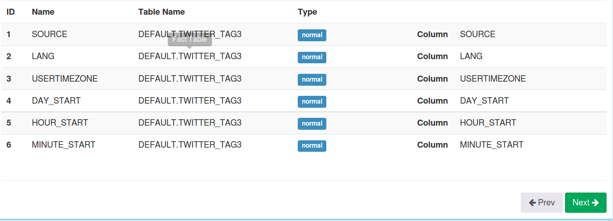

选择Measures。为了统计Twitter热点消息，我们需要的聚集数据的方式为count和TOP_N(其中COUNT会由Kylin自动选择，可以作用于任意维度)，而TOP_N主要是为了对出现次数最多的热词做统计，因此主要针对的维度为HASHTAG，因此我们在TOP_N中选择的Group By维度也是HASHTAG。
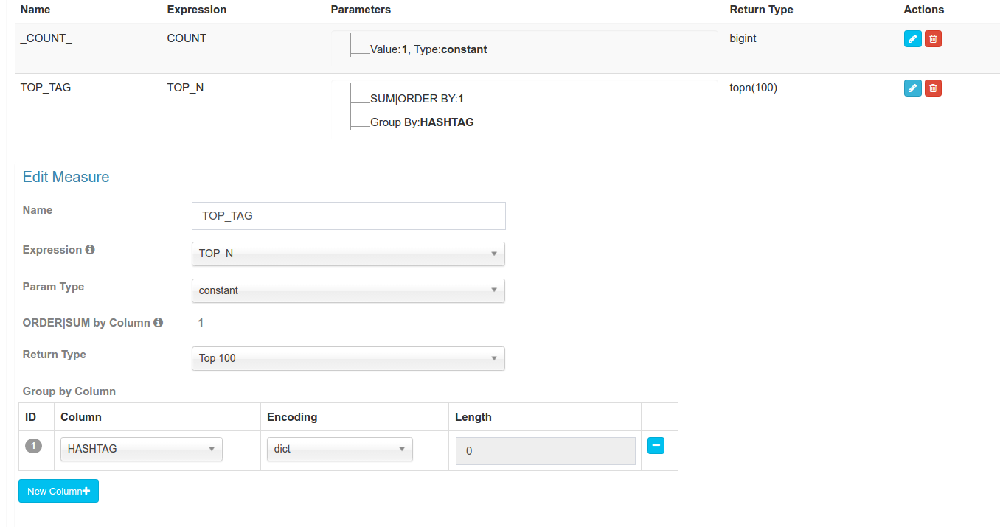

选择segment合并时间，由于我们打算每5分钟触发一次Cube Build，因此会产生大量的segment，过多的segment会降低查询效率，因此这里设置了Auto Merge Threshold，将按照小时、天等单位自动合并cube segment。


一些性能优化相关的高级选项
由于本例中的三个时间维度（天、小时、分钟）具有层级关系，因此我们设定三个时间维度为Hierarchy，这样我们可以将需要构建的Cuboid的数目大幅度减少。（注，层次维度按照自大向小排列）
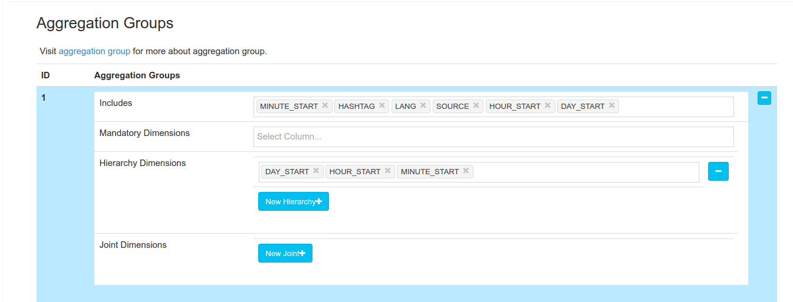

设定Rowkeys次序（由于HBase在过滤数据的时候，会按Rowkey的次序进行过滤，因此将基数高的维度放在前面，可以让一开始的扫描可以过滤更多的数据，从而节省构建时间）


设定一些配置信息，这里*kylin.hbase.regin.cut*指的是hbase在切割region时一个region的大小。这里我们将其大小指定为0.5G
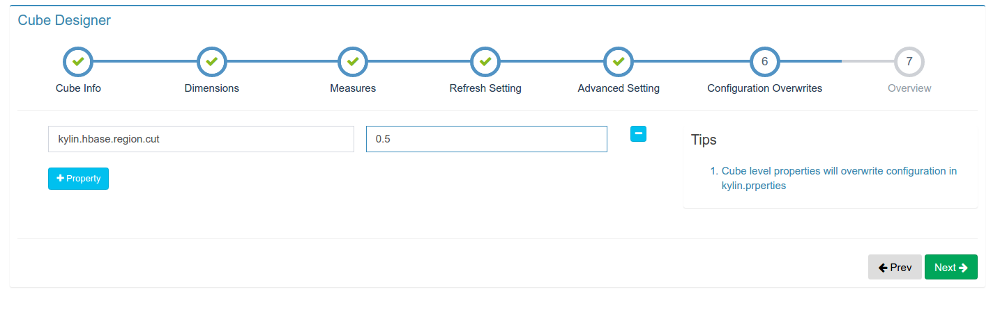

所有配置完成，点击确定后，可以看到我们需要的cube设计完成
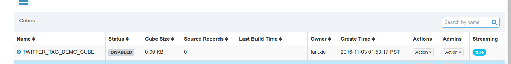

点击`Action`按钮中的`Build`选项即可触发cube的构建

再点击`Monitor`按钮，可以观察到我们的Cube正在构建。并且，Cube的各个Segment会根据我们预先定义的时间进行合并
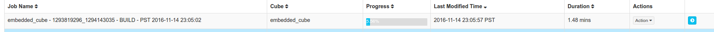


#### 定义cube实现明细热点消息随时间变化的查询
用户在看完热点消息的统计值以后，可能会对某个特定名称的特点消息十分感兴趣。例如，用户可能会看到名为"Trump"的标签十分火热，因此想要详细Trump是什么时候火起来的，也就是看看这个特定名称的标签的热度是怎么随时间变化的。用户可能想要进行如下sql查询
```sql
select HOUR_START , HASHTAG, count(*) as num
from TWITTER_TABLE
where hashtag = 'Trump' and day_start>='2015-10-01' and DAY_START <= '2016-10-16'
group by HOUR_START,hashtag
order by hashtag,HOUR_START
```
这个语句看起来与查询出现次数TOP-N的热点消息最大不同在于我们需要对特定名称的HASHTAG做查询，想要实现这种查询，有两种方式：

1、是在前面定义的cube中，将HASHTAG放到demensions中 

2、是针对这个功能设计一个新的cube

这里我们将采用第二种方法，因此第二种方法实现了两个不同功能cube（聚合查询和明细查询）的区分，在概念上更为明晰，同时，第二种方法也更为节省空间。

选择model
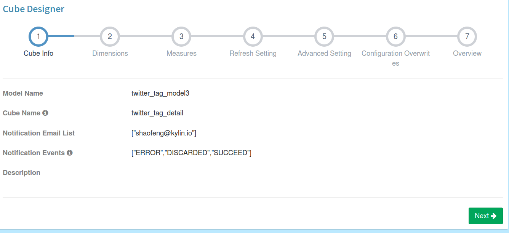

选择dimensions
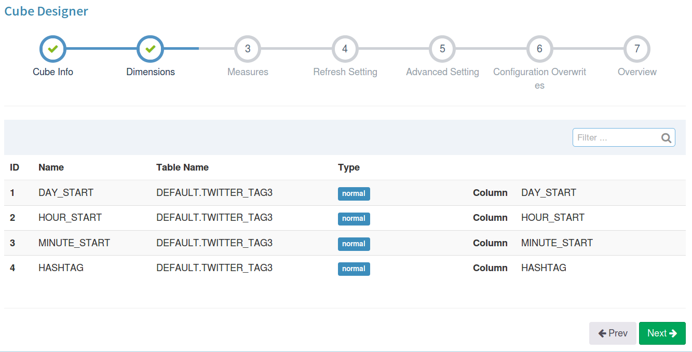

选择measures
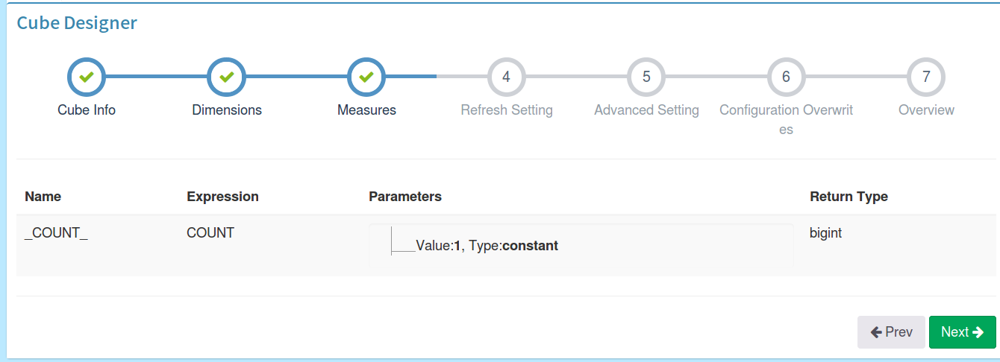

选择segment合并时间
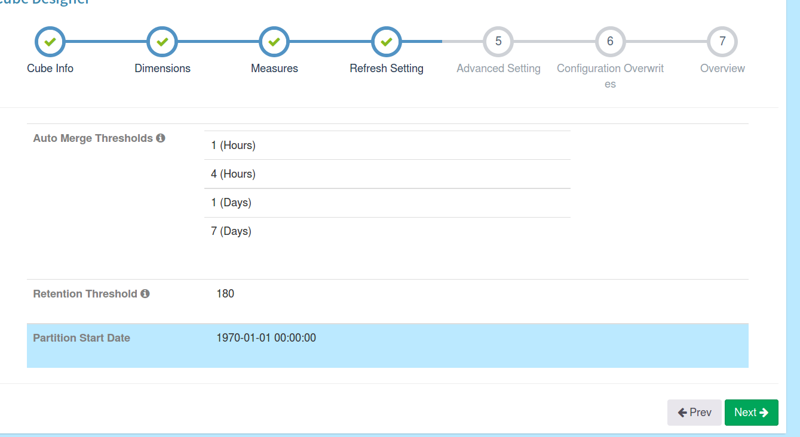

一些性能优化相关的高级选项，是把时间相关的维度定义为Hierarchy，并且把HASHTAG放在Rowkeys最前面
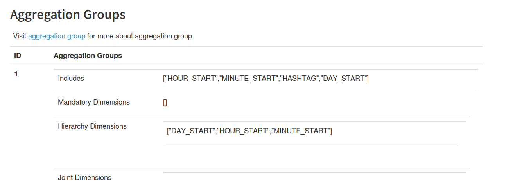

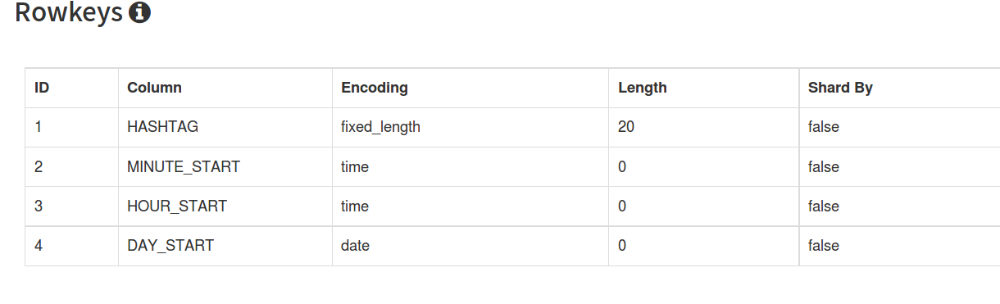

####用sql语句验证查询结果
我们可以点击Insight选项，并用sql语句验证cube是否构建成功
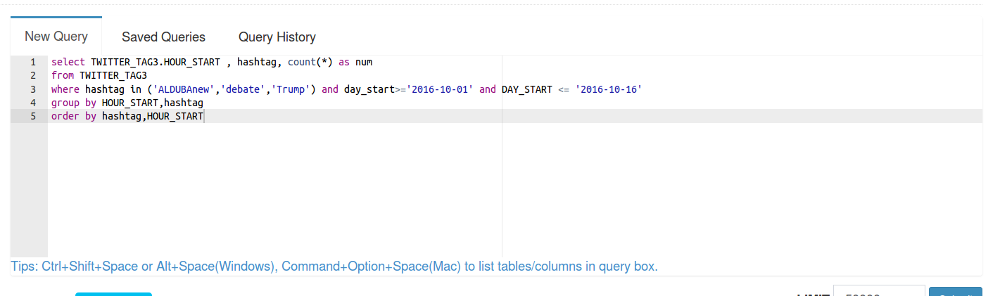

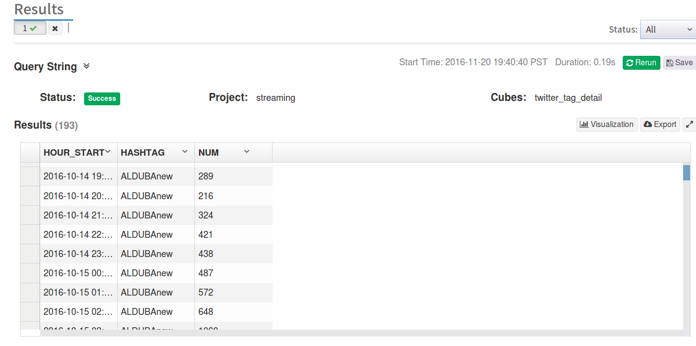

### 定时触发Cube构建
Apache Kylin WebUI中的触发指令只能支持一次触发，但是在实际应用中，我们可能有定时触发构建的需求，我们可以使用Linux的`curl`指令结合`crontab`指令每隔一定时间触发cube的构建。
```shell
crontab -e
*/20 * * * * curl -X PUT --user {username}:{password} -H "Content-Type: application/json;charset=utf-8" -d '{ "sourceOffsetStart": 0, "sourceOffsetEnd": 9223372036854775807, "buildType": "BUILD"}' http://localhost:7070/kylin/api/cubes/TWITTER_TAG_DEMO_CUBE/build2
```

这里*sourceOffsetStart*和*sourceOffsetEnd*制定了构建的范围，这里的offset是Kylin的内部概念，也支持通过Kafka Offset来定义构建的边界，具体请参考Apache Kylin相关文档。*sourceOffsetStart：0*意味着从最近一次构建成功的offset继续构建，如果没有，则从Kafka最早的offset开始构建，*sourceOffsetEnd：9223372036854775807*是Long类型的最大值，指定为这个值，表示构建会持续到当下最新的Offset。这个接口支持了重新构建某个区间的Kafka消息。更多有关Offset设置请参见文章：[Scalable Cubing from Streaming](http://kylin.apache.org/docs16/tutorial/cube_streaming.html)

## Twitter分析结果

我们基于EChart和Apache Kylin REST API开发了这个demo的前端展示webapp，并设计了如下的实时动态报表，所有的报表查询都可以在1秒以内返回结果。

1、按发布语言对Twitter消息进行统计分析。
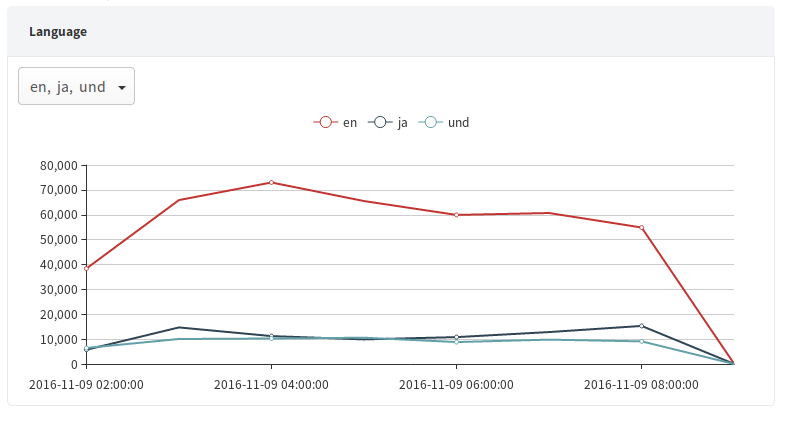

从图表中我们可以看到Twitter的使用者主要是以英语人群为主
查找Twitter中使用最多的八种语言，对应SQL语句：
```sql
SELECT LANG,count(*) as num
FROM TWITTER_TAG3
where day_start>='2016-10-01' and DAY_START <= '2016-10-16'
GROUP BY LANG
ORDER BY num DESC
LIMIT 8
```
查找特定语言的Twitter消息的出现频率：
```sql
SELECT LANG,HOUR_START,count(*) as num
FROM TWITTER_TAG3
where day_start>='2016-10-01' and DAY_START <= '2016-10-16' and LANG in ('en','ko')
GROUP BY LANG,HOUR_START
```

我们还可以将展示的时间跨度拉长，看一下将近一个月内Twitter消息流变化趋势
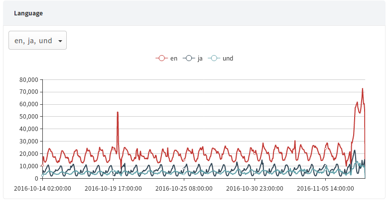

从图中可以看到Twitter消息在过去的一个月内主要有两个爆发点，经过查证，这两个爆发点分别是美国大选第三场辩论赛的时间以及美国大选投票的时候。

2、按发布设备对Twitter消息进行统计分析

从图表中可以看到Twitter用户主要使用的工具为iPhone、Android和Web浏览器。

查找发送Twitter消息最多的八种设备，对应SQL语句：
```sql
select SOURCE,count(*) as num
from TWITTER_TAG3
where day_start>='2016-10-01' and DAY_START <= '2016-10-16'
group by SOURCE
order by num desc
limit 8
```
查找来自特定设备的Twitter消息的出现频率：
```sql
select SOURCE,HOUR_START,count(*) as num
from TWITTER_TAG3
where day_start>='2016-10-01' and DAY_START <= '2016-10-16' and SOURCE in ('Twitter for iPhone','TweetDeck')
group by SOURCE,HOUR_START
```

3、将Twitter上最火热的100个热词以标签云的形式展出
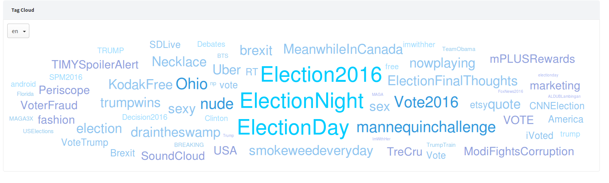

从图中可以看到，目前美国人最关注的事情是美国大选，前三个最多的标签都是关于大选的。同时，我们还看到MeanwhileInCanada标签也十分火热，经过Google查询，笔者发现这个标签主要是讨论加拿大生活的，看来Trump当选以后已经有很多美国人准备移民加拿大了。

对应SQL语句：
```sql
select HASHTAG, count( * ) as num
from TWITTER_TAG3
where LANG='en'
group by HASHTAG
order by num desc
limit 100
```

4、用户如果对标签云中的某个热词感兴趣，还可以对这个热词的出现频率进行明细的查询。
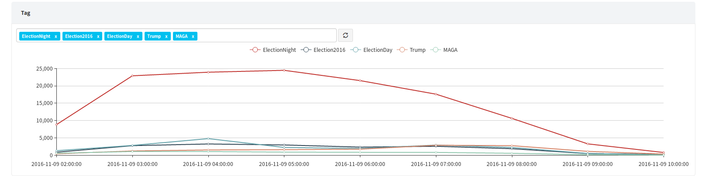

对应SQL语句：
```sql
select TWITTER_TAG3.HOUR_START , hashtag, count(*) as num
from TWITTER_TAG3
where hashtag in ('ElectionNight','Election2016','ElectionDay','Trump','MAGA')
group by HOUR_START, hashtag
order by HOUR_START
```

## 总结
经过从Twitter数据获取、整理到Cube构建，再到前端报表的制作，我们对Kylin的新streaming特性有了更为明确的了解。通过本教程，用户可以了解到如何使用*Apache Kylin*进行实时数据分析。从最后的结果展示部分用户也可以看到*Apache Kylin*新的streaming特性的巨大优势：Apache Kylin 1.6的新streaming特性将流式构建与传统的cube构建深度连接，让用户可以实现实时数据多维分析与历史数据多维分析的整合。用户可以从预定义好的任意多个维度观察数据，并且以O(1)时间复杂度进行海量数据分析，这无疑赋予了用户在海量实时数据上超高的洞见能力。本教程虽然是基于Twitter数据的，但是文中介绍的流程和性能优化手段大部分都是通用的手段，因此想要使用Kylin分析其他实时数据的用户也可以参考此教程。


作者介绍：谢凡，Apache Kylin Contributor, Kyligence实习生，本科毕业于中山大学计算机系。

联系我们：info@kyligence.io


参考资料：

Apache Kylin：http://kylin.apache.org

Kyligence：http://kyligence.io

Scalable Cubing from Streaming: http://kylin.apache.org/docs16/tutorial/cube_streaming.html

New NRT Streaming in Apache Kylin: http://kylin.apache.org/blog/2016/10/18/new-nrt-streaming/