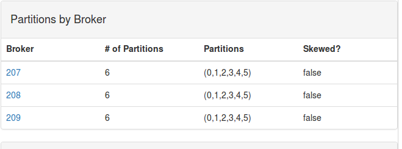
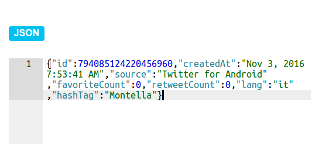
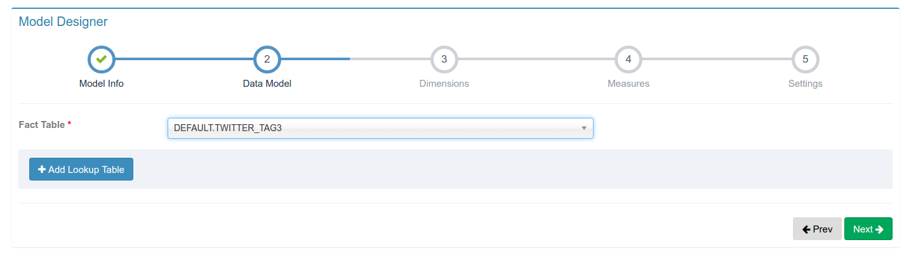
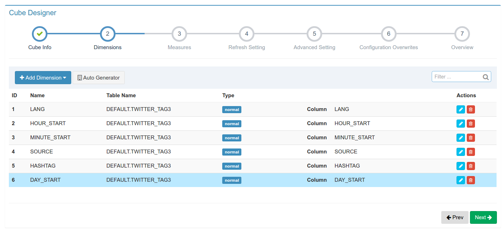

#使用Apache Kylin 新特性实时分析Twitter热点消息
10/27/2016
作者：谢凡（Kyligence实习生）
注：转载请注明出处，原文及来源

<p>Apache Kylin 1.6.0引入了新的streaming特性，新特性具体介绍见（[New NRT Streaming in Apache Kylin](http://kylin.apache.org/blog/2016/10/18/new-nrt-streaming)）。Streaming新特性为用户提供了利用Kylin进行实时数据分析的能力，用户可以以Kafka作为数据源，实时读取流式数据到Kylin，并以分钟（3到5分钟）为间隔实时构建数据立方体。
本文将以Twitter的实时数据为基础，一步步教用户如何利用Twitter API读取Twitter消息并写入Kafka，利用Kylin从Kafka读取流式数据并实时构建数据立方体，最后利用前端报表框架EChart实时地进行Twitter热点数据的展示。本Demo介绍的方法是比较通用的方法，文中介绍的方法对于除了Twitter以外的其他类型的实时数据源，比如微博数据、股票数据等，也有很好的适用性，需要分析其他实时数据的用户也可以根据此Demo进行修改，进行其他数据源的分析。
</p>

[TOC]

####1.数据来源
<p>数据来源于Twitter公开的数据，由每天的实时Twitter消息随机采样而成。（TODO：描述获取数据的方式）

</p>

####2.利用Twitter API实时读取Twitter数据并导入Kafka

首先，你需要准备安装好Kafka环境的服务器若干台，启动Broker并创建对应的Topic(Kafka相关教程请见[Kafka官网](http://kafka.apache.org/documentation))。本人在制作Demo的时候，使用的是AWS上面的3台云服务器，topic名称：TWITTER_TAG_STREAM2。

接着，我们需要写一个简单的Java程序，用于从Twitter API读取数据并且写入到Kafka。如果想要提高读取Twitter消息的并发度，你可以在多台机器上启动这个程序的多个副本。

Java程序主要代码如下
```java
public static void main(String[] args) throws Exception{
        ApplicationContext context = SpringApplication.run(TwitterDemo2.class);
        final KafkaSettings kafkaSettings = context.getBean(KafkaSettings.class);
        Properties prop = new Properties();
        prop.put("bootstrap.servers", kafkaSettings.getBrokers());
        prop.put("acks", "0");
        prop.put("value.serializer", StringSerializer.class.getCanonicalName());
        prop.put("key.serializer", StringSerializer.class.getCanonicalName());
        final String topic = kafkaSettings.getTopic();
        final String topic2 = "TWITTER_TAG_STREAM2";
        final KafkaProducer<String, String> kafkaProducer = new KafkaProducer<String, String>(prop);
        final int factor = kafkaSettings.getFactor();
        final Gson gson = new Gson();
        StatusListener listener = new StatusListener() {
            public void onStatus(Status status) {
                for(int i=0;i<factor;i++){
                    kafkaProducer.send(new ProducerRecord<String, String>(topic, null, gson.toJson(status)));
                    HashtagEntity[] tags = status.getHashtagEntities();
                    if(tags != null && tags.length != 0){
                        for(HashtagEntity tag : tags){
                            TwitterTuple tuple = new TwitterTuple(status);
                            tuple.setHashTag(tag.getText());
                            kafkaProducer.send(new ProducerRecord<String, String>(topic2, null, gson.toJson(tuple)));
                        }
                    }
                }
            }
            public void onDeletionNotice(StatusDeletionNotice statusDeletionNotice) {
            }
            public void onTrackLimitationNotice(int numberOfLimitedStatuses) {
            }
            public void onScrubGeo(long l, long l1) {
            }
            public void onStallWarning(StallWarning stallWarning) {
            }
            public void onException(Exception ex) {
                ex.printStackTrace();
            }
        };
        TwitterStream twitterStream = new TwitterStreamFactory().getInstance();
        twitterStream.addListener(listener);
        // sample() method internally creates a thread which manipulates TwitterStream and calls these adequate listener methods continuously.
        twitterStream.sample();
    }
```


<p>程序首先配置好Kafka相关参数，然后创建了一个`StatusListener`用于监听Twitter，当Twitter消息到达时，就会回调`void onStatus(Status status)`方法获得接收到的Twitter消息。得到Twitter消息后，可以对消息进行处理，提取出自己需要的字段。在Demo中，我们提取出了Twitter消息中id、语言、发送设备、点赞数、被转发数、时区、热点词等字段，并且以JSON格式序列化成消息通过`KafkaProducer`发送到`KafkaBroker`中，为接下来使用Kylin构建Cube做准备。

程序运行成功后，可以用`kafka-console-consumer.sh`读取消息到控制台。</p>
```
{"id":794085124220456960,"createdAt":"Nov 3, 2016 7:53:41 AM","source":"Twitter for Android","favoriteCount":0,"retweetCount":0,"lang":"it","hashTag":"Montella"}
```

同时可以在Kafka中看到如下信息

<p>可以看到每秒的消息量大概在15条左右，一天大概能处理100万+条Twitter消息。当然，这个级别的消息数量远远没有达到Kylin处理的极限，经过实测，在每5分钟构建Cube间隔下，Kylin可以处理每秒钟5万+条消息而没有任何压力。</p>


####3、在Kylin中构建模型
<p>上一步中，我们将利用TwitterAPI读取采样的Twitter消息并将消息中我们需要的字段提取出来后以JSON格式导入到了Kafka中。这一步，我们将利用Kylin的WebUI来创建数据模型、定义Cube并进行定时的Cube构建。这里假设读者在之前已经有一定的Cube构建基础，如果您从来没有构建过简单的Cube，建议您先参考这两篇文章：<br>1、[Quick Start with Sample Cube](http://kylin.apache.org/docs15/tutorial/kylin_sample.html)      <br>2、[Scalable Cubing from Streaming (Kafka)](http://kylin.apache.org/docs16/tutorial/cube_streaming.html)

</p>

#####3.1配置Kafka数据源
<p>1、登录到Kylin WebUI，在Data Source一栏中，选择Add Streaming Table选项

2、用JSON定义消息格式


3、定义Kafka集群配置信息
</p>

#####3.2定义model
<p>在Models一栏中选择New-->New Model创建新的模型定义


命名model


选择事实表（注意Kylin的Streaming暂时还不支持Lookup Table,因此不要选择Lookup Table选项）


选择需要的dimensions(小tips：在定义model时，dimensions可以稍微多选择一些，由于在定义Cube时还需要具体定义需要的dimensions，因此定义model选到额外的dimensions并不会影响最终的性能)


选择需要的measures。由于我们主要是对Twitter的热点消息进行统计，因此主要的measure为HASHTAG
</p>


#####3.3定义Cube
<p>选择New-->New Cube，并且为新创建的Cube命名，Model Name一栏选择步骤3.2中创建的model


选择需要的dimension


选择measures


选择cube合并时间


一些性能优化相关的高级选项
设定三个时间维度为Hierarchy


设定Rowkeys次序（将基数高的放在前面）


设定一些配置信息


所有配置完成，点击确定后，可以看到我们需要的cube构建完成
</p>

点击Action按钮中的Enable选项即可触发cube的构建

#####3.4使用linux指令定时触发cube构建
Kylin WebUI中的触发指令只能支持一次触发，但是在实际应用中，我们可能有定时触发构建的需求，我们可以使用Linux的`curl`指令结合`crontab`指令每隔一定时间触发cube的构建
```linux
crontab -e
*/20 * * * * curl -X PUT --user {username}:{password} -H "Content-Type: application/json;charset=utf-8" -d '{ "sourceOffsetStart": 0, "sourceOffsetEnd": 9223372036854775807, "buildType": "BUILD"}' http://localhost:7070/kylin/api/cubes/TWITTER_TAG_DEMO_CUBE/build2

####4、利用EChart框架结合Kylin RestAPI制作报表

####5、总结
经过从Twitter数据获取、整理到Cube构建，再到前端报表的制作，我们对Kylin的新streaming特性有了更为明确的了解。通过本demo，用户可以了解到如何使用Apache Kylin进行实时数据分析。本Demo虽然是基于Twitter数据
的demo，但是文中介绍的流程和性能优化手段大部分都是通用的手段，因此想要使用Kylin分析其他实时数据的用户也可以参考此demo。


作者介绍：谢凡，Kyligence实习生，吉林大学本科在读。联系我们：info@kyligence.io


参考资料：

Apache Kylin：http://kylin.apache.org

Kyligence：http://kyligence.io


